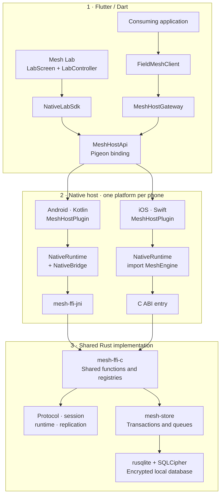
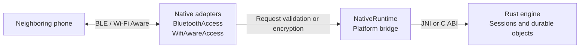
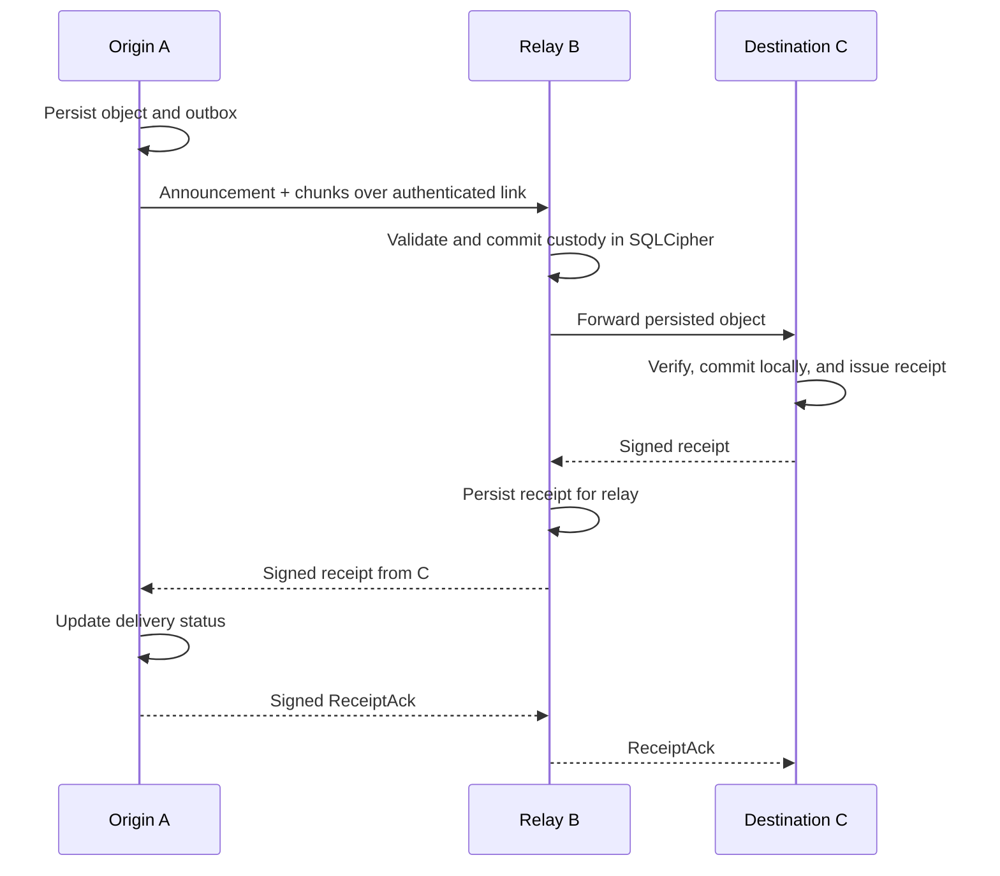

# Mesh Lab

[](LICENSE)

A mobile laboratory and nearby communication core for exchanging **text, location, and voice notes between phones**, using authenticated links and durable storage without requiring an Internet connection for local transport.

The project combines a Flutter test application, native Android/iOS hosts, a shared Rust engine, and a reusable Flutter interface: **Mesh Field SDK**. Other applications can use this infrastructure through the SDK. One application using this technology is **[Convoy Offroad](https://theconvoyapp.com)**.

**Documentation status: September 25, 2026. Estimated overall Mesh plan progress: 81%; Wi-Fi Aware: 90%; communication: 78%.** These are tracking estimates, not test coverage percentages or certifications of functionality. This documentation does not change those gates. Physical evidence and outstanding work are recorded in [docs/progress.md](docs/progress.md), particularly its recent entries.

## Contents

1. [What it is and what it solves](#1-what-it-is-and-what-it-solves)
2. [Current status and scope](#2-current-status-and-scope)
3. [System architecture](#3-system-architecture)
4. [Identity, groups, and security](#4-identity-groups-and-security)
5. [Discovery, radios, and sessions](#5-discovery-radios-and-sessions)
6. [Durable delivery and multiple hops](#6-durable-delivery-and-multiple-hops)
7. [Content types and limits](#7-content-types-and-limits)
8. [Setup and builds](#8-setup-and-builds)
9. [Using the application](#9-using-the-application)
10. [Integrating the SDK](#10-integrating-the-sdk)
11. [Testing and evidence](#11-testing-and-evidence)
12. [Troubleshooting](#12-troubleshooting)
13. [Repository layout](#13-repository-layout)
14. [Open work and reference documentation](#14-open-work-and-reference-documentation)
15. [Glossary](#15-glossary)
16. [License and attribution](#16-license-and-attribution)

## 1. What it is and what it solves

Mesh Lab supports the development and observation of a nearby device communication system when connectivity to a server is unavailable or intermittent. Each phone can originate and receive content and, where its executor and links permit, take custody of it and forward it to other group members.

The word *mesh* describes the ability to form a network of neighbors and carry content across multiple hops. It does not mean every phone is directly connected to every other phone. Nor does it turn a phone into a general Internet access point: relaying actions to a server is a separate function with its own authorization, signatures, and idempotency.

The repository has four main responsibilities:

| Component | Purpose | Consumer |
|---|---|---|
| Mesh Lab application | Operate radios, send content, and observe state during QA | Developers and people testing phones |
| Rust engine | Enforce contracts, cryptography, persistence, and replication rules | Native hosts |
| `mesh_host` plugin | Connect Flutter to Rust and control operating system APIs | Lab app and SDK |
| `mesh_field_sdk` | Provide product operations without exposing topology or keys | Consuming applications |

The lab app uses `mesh_host` directly through `NativeLabSdk`. The product SDK also uses that plugin through `MeshHostGateway`. They are two consumers of the same infrastructure, with different interfaces and presentation rules.

For example, in a group of vehicles, one participant sends a position or voice note, a neighbor receives it over radio, and the system records which recipients acknowledged the object. Interpreting it as a vehicle, chat, map, or user is the consuming application's responsibility; the engine works with certified members, objects, and receipts.

## 2. Current status and scope

The previous README described only F0, the foundation of the Flutter–Rust bridge. The project has moved beyond that stage. F0 remains a testable layer, but the codebase now includes groups, radios, persistence, content, and product adapters.

| Capability | Documented status | Evidence boundary |
|---|---|---|
| Flutter → native → Rust bridge | Implemented, with contracts and tests | A correct bridge does not prove physical connectivity |
| Persistent identity | Android Keystore and Apple Keychain | Not equivalent to an independent security audit |
| Two-way text, GPS, and voice | Implemented; use confirmed by the user in an Android/iPhone product integration | Does not certify every OS and hardware combination |
| Authenticated BLE link | Implemented and physically observed | Exhaustive interruption and restart campaign pending |
| Wi-Fi Aware | Adapters and Android↔Android evidence recorded | iPhone↔iPhone and product regression testing pending |
| Durable relay | Core, persistence, and partial executors | Reproducible physical A→B→C campaign still required |
| Groups of 50 members | Bounded contracts and synthetic tests | No certification with 50 physical radios |
| Background operation | Native foundations implemented | Continuity, locked-screen operation, and power use require validation |
| Product → Internet gateway | Local text code and tests recorded | Remote deployment/E2E and voice/GPS support pending |

Product integration observations recorded in this repository refer to the product consuming the host. They must not automatically be attributed to a particular Mesh Lab application build without recording that build and repeating the test.

F0/F1 documents retain historical value. When they conflict with the current state, consult the code and the latest progress entries. In particular, older statements that radio, text, or voice are absent no longer describe this checkout.

## 3. System architecture

This map describes **the boundaries and call paths of the current code within one phone**. The lab app and an application using the SDK are alternative consumers; Android and iOS are alternative host implementations. Both hosts do not run on the same phone.

The architecture has two views: **the call path into the engine** and **radio communication**. Keeping them separate avoids mixing internal dependencies with links between phones. Protected keys are summarized in a separate table.

**View A · From the application to the engine and storage**

Arrows indicate calls; results and errors return along the same path. Pigeon generates bindings that communicate through `Flutter BasicMessageChannel`, rather than providing an additional service.



Android enters through JNI and reuses Rust functions in `mesh-ffi-c`; iOS calls its `extern "C"` functions through the XCFramework. Both paths converge on the shared implementation. SQLCipher runs within the process; it is not an external server.

This view groups host coordination to show its boundaries. Some operations first pass through the radio executor—for example, `sendText`—before calling `NativeRuntime`, as detailed in 3.2. The arrows are not a complete crate dependency graph.

**View B · Radio and session execution**

This view expands the native host shown above. It represents one local phone and one neighbor; it does not add a second engine inside the phone.



Operating system callbacks deliver data to the adapters. The adapters call Rust through the native bridge and use its results to transmit or process content. **Rust does not open radios directly, and radio frames do not pass through Dart.**

The neighbor link depends on hardware, permissions, signing, and build capabilities. The diagram does not claim Wi-Fi Aware interoperability across all platforms or equivalent relay executors; Android/iOS differences are explained in 3.2.

**Protected keys · host responsibility**

| Platform | Native component | Persistent protection |
|---|---|---|
| Android | `SecureIdentity` | Android Keystore protects stored private material |
| iOS | `SecureIdentity` | Apple Keychain stores private material |

The host supplies the material required by Rust operations. Private seeds are not exposed to the Dart SDK. Persistent protection does not mean every cryptographic operation takes place inside secure hardware.

### 3.1 Flutter: intent, content, and presentation

The lab path is `MeshLabApp → LabScreen/LabController → NativeLabSdk → MeshHostApi`. `LabController`, based on `ChangeNotifier`, projects host data, manages chat, and queries delivery progress. The screen groups Network, GPS, Text, Voice, and Diagnostics.

The product path is `FieldMeshClient → FieldMeshGateway → MeshHostGateway → MeshHostApi`. `FieldMeshGateway` is the replaceable interface used in tests; `MeshHostGateway` is its default native implementation. **Mesh Lab does not call `FieldMeshClient`: it uses its own `NativeLabSdk` adapter directly.** Both paths converge on the same `mesh_host` plugin.

The UI does not validate signatures or declare an object delivered merely because a write completed. It queries evidence produced by the lower layers. However, Dart does handle application content: text, coordinates, and outgoing compressed audio. This architecture should not be described as if no payload ever passed through Flutter.

The lab has additional dependencies omitted from the main map to keep the engine path readable:

| Dependency | Actual use | Relationship to the mesh |
|---|---|---|
| `geolocator` | Obtain a local location fix from `LabController` | The location is encoded and sent through the host's `sendText` |
| `record` | Record AAC/M4A from `LabScreen` | Dart reads the compressed bytes and passes them to `sendVoice` |
| `shared_preferences` | Preserve the lab's chat projection | Does not replace the SQLCipher outbox or establish delivery |

These plugins access their own platform implementations. Location capture and voice recording do not pass through the Rust engine. Playback of received voice is requested through the mesh host. Private seeds and encrypted radio frames remain outside the product Dart API.

### 3.2 Pigeon, hosts, and native execution

The source contract is [mesh_api.dart](platforms/mesh_host/pigeons/mesh_api.dart). **Pigeon generates code; it is not an intermediate runtime service.** Its Dart/Kotlin/Swift bindings use Flutter channels to dispatch operations to `MeshHostPlugin` and return results or errors.

Hosts own discovery, connections, sockets, write queues, access to protected keys, playback, and engine handles. Plugin handlers delegate according to the operation: identity and storage, diagnostics, or radio adapters. For example, `sendText` enters `BluetoothAccess` before that component requests persistence and encryption from Rust.

Radio organization differs between platforms:

- **Android:** `WifiAwareAccess` discovers and establishes Aware links; its `acceptSocket` callback hands the socket to `BluetoothAccess.acceptAwareSocket`. Despite its name, `BluetoothAccess` also executes sessions and content operations for those Aware sockets.
- **iOS:** `WifiAwareAccess` maintains its own connections and Noise sessions, operated through `NativeRuntime`. `MeshHostPlugin` connects this adapter to `BluetoothAccess` through callbacks: outgoing data via `setAwarePayloadSender`, and reception via `setPayloadReceiver`/`acceptAwarePayload`. They share content processing, but ownership of all connections is not centralized in one component.

Thus, separating “BLE” and “Aware” is useful for describing transports, but does not mean there are two fully independent, identical executors on both systems.

On Android, `NativeBridge` loads `libmesh_ffi_jni.so` and exposes JNI methods. **`mesh-ffi-jni` calls Rust functions in `mesh-ffi-c`**, reusing its registries and operations; it does not load a second independent C library. On iOS, `NativeRuntime` imports `MeshEngine` and calls the `extern "C"` functions of `mesh-ffi-c`, packaged in `MeshEngine.xcframework`. Both paths converge on the same shared implementation, although their ABI boundaries differ.

`NativeRuntime` is host code: a Kotlin singleton with a dispatcher and a Swift singleton with a serial queue. It is not the `mesh-runtime` crate. Storage, sessions, and diagnostics have separate handles and states; there is no single `mesh-runtime` object through which every durable operation must pass.

A Dart hot restart is not equivalent to terminating the native process. Nor does it imply that all radio adapters survive every plugin teardown: Android releases its adapters when the Flutter engine detaches and retains the process-scoped store. After changing Rust, rebuild the libraries and relaunch the app; hot reload does not replace native code.

### 3.3 Rust core and persistence

The workspace separates responsibilities so rules can be tested without radios. This table is a functional inventory, not a strictly sequential execution chain:

| Crate | Responsibility |
|---|---|
| `mesh-types` | Identifiers, common structures, and bounds |
| `mesh-codec` | Encoding and decoding, including canonical CBOR |
| `mesh-object` | Objects, manifests, and chunking |
| `mesh-crypto` | Signature, encryption, and delivery key protection primitives |
| `mesh-protocol` | Policies, certificates, announcements, and authenticated receipts |
| `mesh-session` | Noise handshake, authentication, and replay protection |
| `mesh-link` | Bounded, radio-independent record framing; not a BLE/Aware driver |
| `mesh-runtime` | Diagnostic, send, and receive state transitions |
| `mesh-store` | SQLCipher persistence, policies, and durable transactions |
| `mesh-replication` | Neighbors, presence, deduplication, and relay/transport rules |
| `mesh-sim` | Synthetic validation tools and scenarios; not a layer in the mobile call path |
| `mesh-ffi-c` | C ABI entry, shared Rust functions, and runtime/store/session handle registries |
| `mesh-ffi-jni` | JNI adaptation of arguments, results, and errors for Android |

`mesh-store` uses `rusqlite` with bundled SQLCipher and a bundled cryptographic provider. The host supplies the path and opening material; Rust maintains transactions and persistence rules. Store encryption does not imply that every UI content copy, temporary file, or playback cache is inside that database.

Native adapters perform physical operations and part of transport coordination. The existence of a pure Rust policy, such as transport selection per object, does not prove that every host already consumes that decision. Outstanding executor work is described in section 6 and [relay-host-executor.md](docs/relay-host-executor.md).

### 3.4 Data flow and state observation

**Outgoing:** Dart supplies content and a logical ID to the Pigeon binding; the plugin delegates to the native executor. The executor asks Rust to validate and persist the operation, reads outbox records, and requests session protection before sending them through the corresponding native transport. The operation's return value indicates admission or rejection, not complete delivery to the recipient.

**Incoming:** a radio callback delivers bytes to the native adapter. `NativeRuntime` and FFI validate the Noise session; the durable record is then processed and content committed when appropriate. The host projects verified results into state or event queues. Dart queries these projections through Pigeon; radio bytes are not routed through the widget tree.

**Observation:** `FieldMeshClient.watch()` polls periodically; verified reception capabilities drain host queues. The diagnostic contract's `subscribe(cursor)` also returns a snapshot through a request. Here, the names `watch` and `subscribe` do not imply an `EventChannel` or a push stream of frames from Rust to Flutter.

### 3.5 Evidence supporting the map

The main relationships were checked against these entry points in the checkout:

| Relationship | Code evidence |
|---|---|
| App → `NativeLabSdk` | [main.dart](app/lib/main.dart) creates `LabScreen` with that adapter by default |
| `NativeLabSdk` → `MeshHostApi` | [lab_controller.dart](app/lib/core/sdk/lab_controller.dart) delegates each operation to `_api` |
| SDK → gateway → Pigeon | [field_mesh_client.dart](packages/mesh_field_sdk/lib/src/field_mesh_client.dart) constructs `MeshHostGateway` by default, which uses `MeshHostApi` |
| Android dispatch and radio connection | [MeshHostPlugin.kt](platforms/mesh_host/android/src/main/kotlin/com/frazko/mesh_host/MeshHostPlugin.kt) registers the API and connects `acceptSocket` |
| iOS dispatch and Aware callbacks | [MeshHostPlugin.swift](platforms/mesh_host/ios/mesh_host/Sources/mesh_host/MeshHostPlugin.swift) registers the API and connects content callbacks |
| Android → JNI → shared functions | [NativeBridge.kt](platforms/mesh_host/android/src/main/kotlin/com/frazko/mesh_host/NativeBridge.kt) and [mesh-ffi-jni](crates/mesh-ffi-jni/src/lib.rs) |
| iOS → C ABI | [NativeRuntime.swift](platforms/mesh_host/ios/mesh_host/Sources/mesh_host/NativeRuntime.swift) invokes `mesh_*` functions |
| Shared handles and operations | [mesh-ffi-c](crates/mesh-ffi-c/src/lib.rs) maintains registries and calls engine modules |
| Store → SQLCipher | [mesh-store/Cargo.toml](crates/mesh-store/Cargo.toml) and [mesh-store/src/lib.rs](crates/mesh-store/src/lib.rs) |

This review establishes that the map matches the sources examined. Functional correctness under interruptions, concurrency, or background operation requires the corresponding tests; it cannot be inferred from a correct diagram.

## 4. Identity, groups, and security

### 4.1 Installation identity

Each installation prepares four independent 32-byte materials: identity, HPKE delivery, a Noise static session key, and a database key. Private seeds do not cross Pigeon into Flutter.

On Android, an AES-GCM key in Android Keystore protects material persisted in the private directory excluded from backups. On iOS, material is stored in Keychain with `AfterFirstUnlockThisDeviceOnly` and without synchronization. These protections do not mean all Ed25519 or Noise operations occur inside secure hardware: the host uses material in memory to operate.

The public property named `fingerprint` currently represents the 32-byte Ed25519 public key as 64 lowercase hexadecimal characters. It is neither a password nor an application account identifier. The product must explicitly bind this cryptographic identity to its authorized user.

### 4.2 Group, authority, and epoch

A certified policy identifies the group, its epoch, and admitted members. The roster supplies the identities accepted when authenticating sessions and objects. The authority signs this policy; observing a radio announcement is not sufficient to become a member.

Mesh Lab retains an experimental open enrollment mode. Product integration adds an admission policy with public identities authorized by the product. These are different trust contexts: the lab experience must not be copied as production authorization.

The SDK offers optional controls to configure admission and scope, query whether the local identity can issue enrollments, and prepare an authority handoff. The signed handoff binds the successor to the next epoch; a new key is not simply accepted as the authority. Complete product leadership migration, distribution, and ACKs still have open operational gates.

The product scope is a 128-bit hexadecimal identifier. Hosts separate storage by scope using `mesh-store/<scope>/state-v1.db`. Changing groups requires closing the previous session and clearing its active policy. Keeping an encrypted database from another scope does not make it the current radio group.

### 4.3 Link authentication

The implemented profile is `Noise_XX_25519_ChaChaPoly_SHA256`. The XX handshake establishes session material; both endpoints must then produce and verify an Ed25519 AUTH proof bound to the transcript, group, epoch, member, and role.

The handshake hash is used as the session identifier. The canonical CBOR prologue includes the group and epoch. Authentication therefore relies on more than a remote device answering over Bluetooth.

The [session profile](schema/session/lab-v1.md) specifies:

- Three handshake messages with empty payloads and sizes of 32, 96, and 64 bytes.
- A 30-second handshake deadline in the session module.
- Application payloads of up to 4096 bytes per session record.
- A frame containing version, a 32-byte session ID, a `u64` packet number, and ciphertext.
- A 64-packet replay window per direction.
- Data counters starting at 1 and remaining below `2^20`.
- Reconnection through a new XX handshake with fresh entropy and counter space.

The receive counter advances only after successful validation. A tampered packet cannot advance the window. A sender's nonce is never rewound to retransmit content.

### 4.4 Object protection

Link and object protection serve different purposes. Noise protects the hop between neighbors. The object protocol signs the origin and protects content for its audience, so persistence and receipts remain verifiable across relays.

The provider uses Ed25519, HPKE with X25519/HKDF-SHA256/ChaCha20-Poly1305, and authenticated chunk encryption. Signature domains separate certificates, objects, receipts, session authentication, handoffs, and cloud relay proofs.

The project does not claim an independent cryptographic audit, perfect erasure of every memory copy, or certified production security. Rejection behavior and repository tests are implementation evidence, not substitutes for such an audit.

## 5. Discovery, radios, and sessions

### 5.1 Bluetooth LE

BLE provides discovery, enrollment, and authenticated transport. Hosts fragment records according to GATT/ATT constraints and maintain queues to avoid mixing fragments or changing encryption order.

Link health is checked using authenticated responses and a monotonic clock: the implementation records probes every 3 seconds and expiry after 12 seconds without valid proof. A write accepted by the operating system does not by itself renew a neighbor's liveness.

Public enrollment records use a versioned 128-bit domain. This avoids confusing an opaque Noise record with an enrollment message because a single byte happens to match—a failure found during physical testing.

### 5.2 Wi-Fi Aware

Wi-Fi Aware provides discovery and direct links on compatible devices. The user flow does not require entering router, hotspot, SSID, or IP settings. The host still handles networking primitives and sockets internally; IP is not absent from every layer.

Android requires the corresponding device support, APIs, and permissions. The iOS adapter checks for iOS 26 or later, hardware capabilities, and integration availability. Signing and the Wi-Fi Aware entitlement determine what an actual build can open. The iOS 15 minimum build target does not guarantee Wi-Fi Aware support.

The neighbor plan limits each node to two direct Aware candidates and derives the overlay from the certified roster. The core supports predecessor/successor relationships and an additional BLE link in certain topologies. That mathematical rule does not certify physical replacement of out-of-range neighbors or convergence under interruptions.

### 5.3 States that must remain distinct

An available radio, a discovered peer, an authenticated link, and a confirmed delivery are different facts. The UI or product must preserve this distinction:

1. The device has the radio and permissions.
2. The host discovers a candidate.
3. The session validates Noise and the certified identity.
4. The transport becomes ready for content.
5. An object enters the outbox.
6. Its recipients issue valid receipts.

Pending Wi-Fi Aware must not block a usable BLE link. Conversely, a connection visible to the operating system must not be presented as a secure session without authentication.

## 6. Durable delivery and multiple hops

### 6.1 From sending to a receipt

Sending follows a verifiable sequence:

1. The application supplies content and a logical ID, or the SDK generates that ID.
2. The host requests creation of the objects required for the certified audience.
3. Rust validates, signs, seals, and persists the content and its operation in SQLCipher.
4. The executor reads the outbox and emits records over authenticated links.
5. The receiver validates the announcement before accepting chunks.
6. Once the object is complete, it verifies the content and commits local delivery and its receipt.
7. The origin validates receipts and updates the logical action's aggregate status.
8. A `ReceiptAck` signed by the origin allows retries of the corresponding receipt to stop.



The diagram represents the durable contract. Its existence in code and FFI tests does not yet certify that complete topology across three physical radios.

### 6.2 Custody and recovery

A relay must persist before forwarding. The final chunk's commit and associated custody must be consistent; a RAM buffer does not replace the durable queue. When a link returns, executors drain the applicable object, receipt, and ACK queues.

`received_from` identifies the authenticated neighbor that delivered the record. Forwarding must exclude that neighbor and update hop information. Hop limits and deduplication prevent unlimited circulation. Content TTL and hop budget are separate controls.

The Android executor supports authenticated BLE/WFA paths. Executor documentation still lists iOS relay to an individual WFA neighbor with precise ingress exclusion as pending. Full integration of common per-object selection and physical failover validation are also outstanding. See [relay-host-executor.md](docs/relay-host-executor.md).

### 6.3 Delivery states

The SDK interface exposes these aggregate states:

| State | Meaning |
|---|---|
| `queued` | Action admitted to the queue; full confirmation still pending |
| `partial` | Part of the audience has acknowledged it |
| `delivered` | The required audience has acknowledged it through valid receipts |
| `expired` | Expired before the required delivery completed |

The internal relay contract also distinguishes concepts such as `custodied` and `no_route`. These must not be confused with the SDK's public enum.

Successful `sendText`, a GATT write, or a socket closing does not establish `delivered`. A mesh receipt is also distinct from an application server's ACK: each path retains its own evidence.

### 6.4 Logical actions and physical objects

A group supports up to 50 certified members, but a protected object supports up to 10 recipients. Group sending splits a logical action into objects with bounded audiences and aggregates their receipts. Consequently, a message's logical ID and each object's ID are not interchangeable.

A member joining later does not automatically receive all previous history. The audience is defined at send time; joining a group does not grant general retroactive access to earlier messages.

## 7. Content types and limits

| Layer | Current limit or format | Main source |
|---|---|---|
| Group | 50 certified members | `mesh-types/src/durable.rs` |
| Protected object | Up to 10 recipients | `mesh-types/src/durable.rs` |
| Durable chunk | 1024 bytes | `mesh-types/src/durable.rs` |
| Storage object | 64 KiB and up to 64 chunks | `mesh-types/src/durable.rs` |
| Protocol plaintext | 48 KiB | `mesh-protocol/src/lib.rs` |
| Noise application record | Up to 4096 bytes | Session profile |
| SDK text | Encoded envelope of up to 2048 UTF-8 bytes | `field_mesh_client.dart` |
| SDK voice | Up to 10 s and 47 KiB of encoded audio | `field_mesh_client.dart` |
| SDK voice context | Up to 512 UTF-8 bytes when supplied | `field_mesh_client.dart` |
| Mesh Lab voice | Up to 8 s, AAC-LC/M4A, mono, 16 kHz, 24 kb/s | `lab_screen.dart` |
| Logical ID supplied to the SDK | 32 lowercase hexadecimal characters | `field_mesh_client.dart` |
| Object ID for playback | 64 lowercase hexadecimal characters | `field_mesh_client.dart` |
| Relay | Up to 16 hops; deduplication bounded to 512 entries | `mesh-replication/src/lib.rs` |

These limits belong to different layers. A storage maximum does not promise that the UI will accept any payload of that size. UTF-8 is measured in bytes: emojis, metadata, and envelopes consume the budget even when visible text appears short.

**Text.** The lab wraps messages with an ID and hybrid timestamp for its chat. The SDK uses its own action envelope to preserve the logical ID within protected content. Sharing a host does not make all application envelopes interchangeable.

**Location.** Mesh Lab requests a single geolocation fix and sends it through the durable content path. `FieldLocation` provides coordinates, accuracy, time, and optional heading. A received position may be old: the product must preserve its timestamp and decide when to display it as stale. The SDK does not by itself provide continuous global background tracking.

**Voice.** These are complete notes, not real-time calls. The lab records, reads the compressed file, and passes it to the host. The SDK's verified reception identifies the object and supports playback by ID from private storage, without handing an audio path or bytes to the receiving product.

## 8. Setup and builds

### 8.1 Repository toolchain

The following versions come from project configuration and CI files; they are not intended to identify the latest versions released by their vendors.

| Tool | Version/configuration |
|---|---|
| Flutter | 3.47.2, in `.flutter-version` |
| Dart | `^3.13.2` constraint in pubspec files |
| Rust | 1.98.1, in `rust-toolchain.toml` |
| Android NDK | 28.2.13676358 |
| JDK | 21 |
| Gradle / AGP / Kotlin | 9.3.1 / 9.1.0 / 2.4.0 |
| Xcode | Historical local evidence with 26.4.1 |
| Python | Python 3 for repository tools |

Native targets are Android ARM64/x86_64, physical iOS ARM64, and iOS simulator ARM64/x86_64. Initial minimum build targets are Android API 24 and iOS 15. Support for each radio requires additional runtime checks.

Apple builds require macOS with Xcode. Android requires the pinned SDK/NDK; `build_native.py` checks `ANDROID_HOME` and falls back to `~/Library/Android/sdk` when it is unset. C compilers are required because SQLCipher and its cryptographic provider are built alongside Rust.

### 8.2 Build the libraries

From the repository root:

```sh
export PATH="$HOME/.cargo/bin:$PATH"
python3 tools/build_native.py all
```

Replace `all` with `apple` or `android` to build one platform. The script adds Rust targets and produces:

- Apple: `platforms/mesh_host/ios/mesh_host/MeshEngine.xcframework`.
- Android: `platforms/mesh_host/android/src/main/jniLibs/<abi>/libmesh_ffi_jni.so`.

Binaries are local artifacts ignored by Git. A fresh checkout must generate them before building Flutter. Rebuilding is also required after Rust changes.

### 8.3 Resolve dependencies and run

```sh
cd app
flutter pub get --enforce-lockfile
flutter devices
flutter run --release -d <device-id>
```

Replace `<device-id>` with the actual identifier. For simulators and UI development, use `flutter run -d <simulator-id>`; physical campaigns use Release builds of the normal app.

Build packages from `app/`:

```sh
flutter build apk --release --target-platform android-arm64,android-x64
flutter build ios --release
```

The APK is produced at `app/build/app/outputs/flutter-apk/app-release.apk`, relative to the repository root. The iOS build requires valid signing for installation on a phone. `flutter build ios --release --no-codesign` checks compilation without producing a signed app ready for installation.

Do not install the instrumentation runner over the app during a normal usage campaign. Instrumented tests have their own procedure and may replace the entry point.

## 9. Using the application

The lab UI currently uses Spanish labels. This section gives English descriptions and retains exact UI labels in parentheses where needed to find controls.

### 9.1 First session with two phones

The lab app's visible group creation flow starts on Android.

1. Install a current Release build on both phones and open Mesh Lab.
2. Open **Diagnostics → Prepare identity** (`Diagnóstico → Preparar identidad`) on each device. Check that a public fingerprint and protected storage are available.
3. On the Android phone that will be the initial authority, open **Network → Create new group** (`Red → Crear grupo nuevo`).
4. Tap **Connect session** (`Conectar sesión`) on that Android phone.
5. On the second Android phone, use **Find nearby group** (`Buscar grupo cercano`). On iPhone, keep it near the Android creator and use the available search while it has no group.
6. Grant the requested permissions and check Bluetooth and Wi-Fi Aware details in Network.
7. Wait for enrollment and an authenticated link. A count of detected devices is not sufficient.
8. Send a short text in each direction first and inspect its delivery status.

Creating separate groups on both phones does not make them members of the same group. The second installation must enroll under the first phone's policy.

If a persisted group already exists, preparing identity recovers its state. There is no need to create a new group every time the app opens. The state shown in Network determines whether to connect or wait for recovery.

### 9.2 Network screen

Shows group, session, and radio details. **Connect session** starts BLE and Aware discovery; **Leave session** (`Salir de sesión`) stops those searches and associated retries. Leaving does not erase identity or uninstall the application.

Read an unavailable capability together with its stated reason: permissions, hardware, system version, policy, or connection state. Not all iOS builds have the same Wi-Fi Aware capability even when they share the UI.

### 9.3 Text screen

Write a message and tap **Send** (`Enviar`) with a secure link available. Its appearance in chat means the operation was admitted to the queue. Check the acknowledgment count and status until delivery, partial delivery, or expiry.

The SDK interface and lab currently check for a secure connection before admitting certain sends. Persistence allows recovery of content already admitted; it does not imply that the UI supports composing and queuing every message type without any connected neighbor.

### 9.4 GPS screen

Tap **Share my location** (`Compartir mi ubicación`), grant location permission, and wait for a valid fix. Check the coordinates and update time. The receiver displays the location shared by the other phone.

An indoor test without a GPS fix does not validate this flow. Test with sufficient signal and record the original time to distinguish a new position from a delayed delivery.

### 9.5 Voice screen

With a secure link, use the recording control and grant microphone permission. The lab stops automatically after 8 seconds. Once recording ends, audio enters durable sending. On the receiver, use **Play latest note** (`Reproducir última nota`) when the host indicates it is ready.

The SDK's 10-second maximum does not change this screen's 8-second limit. Quality and latency depend on the link and pending queue.

### 9.6 Diagnostics screen

Supports preparing or recovering identity and inspecting the engine, ABI/API contract, process instance, sequence, and build. **Verify bridge** (`Verificar puente`) checks the call through to Rust; **Recover state** (`Recuperar estado`) queries snapshots.

Process diagnostic state and durable storage are distinct. A new process may have a different diagnostic instance while retaining identity, policy, and persistent queues. Clearing data or uninstalling changes the test and may destroy material needed to recover the store.

## 10. Integrating the SDK

The local package is `packages/mesh_field_sdk`, with declared version `0.2.5` and `publish_to: none`. Integrate it using a path dependency appropriate to the product checkout. Do not assume it has been published to a public registry.

### 10.1 Startup and sending

This example assumes the application has already resolved group membership. Automatically creating a group for every product or on every launch would be incorrect.

```dart
import 'package:mesh_field_sdk/mesh_field_sdk.dart';

Future<FieldDelivery?> sendTextExample(FieldMeshClient mesh) async {
  await mesh.prepareIdentity();
  final group = await mesh.groupInfo();
  if (!group.configured) {
    // Resolve group creation or enrollment according to product policy.
    return null;
  }

  // connect starts discovery; it does not necessarily wait for authentication.
  final session = await mesh.connect();
  if (!session.secure) return null;

  final delivery = await mesh.sendText('Meeting point confirmed');
  // Keep delivery?.logicalId to query mesh.delivery(id).
  return delivery;
}
```

The application can observe `mesh.watch()` and enable sending when the state is secure. `watch()` polls the host periodically—once per second by default—and emits changes; it is not a direct radio push subscription. Cancel the subscription when its owner is disposed.

### 10.2 IDs, reception, and delivery

If the product already has a persisted action, use `sendTextWithLogicalId`, `sendLocationWithLogicalId`, or the voice variants. The supplied ID must contain 32 lowercase hexadecimal characters. A hyphenated UUID requires explicit conversion in the adapter and preservation of its mapping.

Store the logical ID and query `delivery(id)` to update the product outbox. Treat a null return as an operation that was not admitted or has no available result, depending on the operation; never as successful delivery.

To attribute incoming actions, use `watchVerifiedIncomingText()` and `watchVerifiedIncomingVoice()`. These capabilities consume native queues of verified objects and provide a certified origin, object ID, and timestamp alongside content-specific data. The SDK validates their format again.

`watchIncoming()` is a simplified projection based on the latest message and its counter. It does not replace a verified queue for products that need to preserve bursts, attribution, and reconciliation. Verified queues are also bounded: the consumer must drain them and persist what its product requires.

The application must validate that the certified origin corresponds to an authorized member of its domain, deduplicate the action, and handle conflicts. A user's display name does not replace that binding.

### 10.3 Product capabilities

| Capability | Purpose |
|---|---|
| `FieldMeshEnrollmentAccessController` | Install an authorized roster and product scope |
| `FieldMeshClient` handoff operations | Prepare handoff, rotate authority, and apply authorized policy |
| `FieldMeshCloudRelaySigner` | Sign canonical content for authorized cloud relay |
| `FieldMeshVerifiedIncomingSource` | Receive text/location actions with origin evidence |
| `FieldMeshVerifiedIncomingVoiceSource` | Receive verified voice notes by object |
| `FieldMeshVoiceContextSender` | Seal product context alongside audio |

`playVerifiedVoice(objectId)` plays the corresponding private object. Do not base a product's voice history solely on “latest note,” because two objects can arrive outside the expected visual order.

`FieldMeshGateway` allows the host to be replaced with a fake in product tests. That fake is not evidence of actual radio behavior, permissions, or persistence.

### 10.4 Internet and mesh in a consuming application

The consuming application decides how to bind participants, history, positions, and authority. It can maintain nearby presence while using the Internet and reconcile actions by logical ID. The server retains its own ACK and access controls.

The certified gateway signs a canonical envelope bound to group and epoch without exposing seeds. Recent tracking documents a local queue and text validation for server relay; deployment and remote E2E remain pending. Having `signCloudRelay` capability does not by itself enable an operational gateway.

## 11. Testing and evidence

### 11.1 Engine and tooling validation

From the root:

```sh
cargo fmt --all -- --check
cargo clippy --workspace --all-targets --all-features --locked -- -D warnings
cargo test --workspace --locked
python3 tools/test_f1.py
python3 tools/test_f1_crypto_runtime.py
python3 tools/check_contracts.py
python3 -m unittest discover -s tools/tests -v
```

F1 scenarios exercise storage, cryptography, and recovery on the host. Their reports must not be labeled as phone-to-phone tests.

### 11.2 Flutter and the generated contract

Resolve dependencies inside each package before running its checks:

```sh
(cd platforms/mesh_host && flutter pub get --enforce-lockfile && flutter analyze)
python3 tools/check_pigeon.py
(cd packages/mesh_field_sdk && flutter pub get --enforce-lockfile && flutter analyze && flutter test)
(cd app && flutter pub get --enforce-lockfile && flutter analyze && flutter test)
```

`check_pigeon.py` regenerates the three bindings and compares their hashes. It can modify files if it detects divergence; review the diff and keep bindings synchronized with the source contract.

### 11.3 Native hosts

```sh
sh tools/test_apple_host.sh
cargo build --locked -p mesh-ffi-jni
(cd app/android && ./gradlew :mesh_host:testDebugUnitTest :mesh_host:assembleRelease)
```

Set `JAVA_HOME` to JDK 21 before invoking Gradle directly. JVM unit tests load a host Rust library; they do not execute the Android `.so` on a phone.

The CI declared in [.github/workflows/foundation.yml](.github/workflows/foundation.yml) includes contracts, suites, and builds. It also declares a 90% threshold for new instrumented Rust/Dart lines in PRs. This does not imply 90% coverage of native callbacks or a successful remote run during this documentation review.

### 11.4 Reproducible physical campaign

For each run, record commit/build, device models, OS, permissions, radios, group/epoch, topology, time, and result. QA progresses through:

1. Two phones: enrollment and authentication, text in both directions, valid GPS, and voice.
2. Recovery: disable radio, move out of range, terminate a process, and return without Internet.
3. Three phones: A→B→C without a direct A↔C link; restart B and observe recovery.
4. Verify receipts, absence of duplicates, and original content timestamps.
5. Background/locked-screen operation and power measurement.
6. Larger groups and a hardware matrix, including the iPhone↔iPhone Aware campaign.

The absence of an A↔C link must be demonstrated: visually separating phones is not enough to conclude that multiple hops occurred. Do not declare the gate passed solely because C received the message.

Commands in this section are reproduction instructions. This entire campaign was not run while writing the README; prior results remain in the progress log and corresponding artifacts.

## 12. Troubleshooting

| Symptom | What to check |
|---|---|
| Flutter cannot find a native library | Run `build_native.py` for the platform and rebuild the app |
| Rust changes do not appear | Rebuild XCFramework/JNI and relaunch the process; hot reload is insufficient |
| Phones are discovered but no secure session forms | Group/epoch, enrollment, certified identity, permissions, and Noise logs |
| Each phone has a group but they do not authenticate | Check that two independent groups were not created |
| iPhone reports Aware unavailable | iOS version, hardware capability, entitlement, and signing of the installed artifact |
| Stuck on “Connecting” after a restart | Check GATT teardown, timeouts, and fresh authentication; do not trust a stale neighbor |
| Text remains queued without delivery | Authenticated links, audience, receipts, and expiry; a local write is not an ACK |
| Short text is rejected | Measure the full UTF-8 envelope, including metadata and emojis |
| GPS does not change | Permissions, location service, valid fix, and original timestamp |
| Voice is not sent | Microphone, duration, encoded size, secure link, and outgoing queue |
| Key or store failure after clearing data | Do not silently recreate an identity over a previous store; check installation consistency |
| Gradle uses a different JVM | Check JDK 21 and `JAVA_HOME` for direct commands |

Keep host and engine logs alongside the build used. Do not include seeds, database keys, or private material in diagnostic reports. Complete diagnostic export remains an open completion item.

## 13. Repository layout

```text
mesh_lab/
├── app/                         # Flutter lab application
│   ├── lib/core/sdk/             # Controller and NativeLabSdk adapter
│   └── lib/features/laboratory/  # Usage and diagnostic screens
├── packages/mesh_field_sdk/      # Flutter interface for products
├── platforms/mesh_host/          # Plugin, Pigeon contract, and native hosts
│   ├── pigeons/                 # Contract source
│   ├── android/                 # Kotlin, JNI, and Android radios
│   └── ios/                     # Swift, C ABI, and Apple radios
├── crates/                      # Rust workspace
├── schema/                      # API, protocol, session, store, and telemetry
├── vectors/                     # Conformance and session vectors
├── tools/                       # Builds, contracts, coverage, and evidence
├── docs/                        # Design, tracking, tests, and open work
└── .github/workflows/           # CI definition
```

The architecture HTML files at the root preserve the specification and design plan. A capability described there may be a goal; its presence in the specification does not prove it is implemented.

## 14. Open work and reference documentation

Plan completion still requires, among other work:

- A three-phone campaign with actual multiple hops for text, voice, and GPS.
- Measured offline recovery, interruptions/reconnection, and restarts.
- Background operation, locked-screen behavior, and power use.
- Cloud gateway deployment, actual E2E, and support beyond text.
- Neighbor replacement, physical per-object selection, and propagated presence.
- Physical groups of 5/10/50 and Wi-Fi Aware between compatible iPhones.
- Isolation when changing groups, membership, and leadership under interruptions.
- Diagnostics/export, native coverage, and an independent security audit.

Some linked documents are in Spanish and retain historical context. Read their status alongside recent progress entries and current source code.

| Document | Purpose and currency |
|---|---|
| [Progress](docs/progress.md) | Evidence log; prioritize recent entries |
| [Known gaps](docs/known-gaps.md) | Technical inventory; cross-check historical states against progress |
| [Durable executor](docs/relay-host-executor.md) | Custody, relay, and outstanding host work |
| [Noise profile](schema/session/lab-v1.md) | Exact format and limits of the implemented session |
| [SDK](packages/mesh_field_sdk/README.md) | Interface introduction; some integration references are historical |
| [Foundation contract](docs/foundation-contract.md) | F0 diagnostic boundary |
| [SDK completion plan](docs/sdk-closure-and-product-integration-plan.md) | Product and security gates |
| [Internet and mesh](docs/hybrid-internet-mesh-plan.md) | Hybrid design; not evidence of deployment |
| [Wi-Fi Aware mesh](docs/wifi-aware-mesh-50.md) | Group design and bounded topology |
| [Aware validation](docs/wifi-aware-validation-plan.md) | Radio matrix and campaign |
| [Coverage](docs/testing-coverage.md) | Scope of measurements and tests |
| [Historical mobile tests](docs/mobile-testing.md) | F0 evidence/procedures; its opening does not describe current capabilities |

Original Mesh Lab code is distributed under Apache-2.0. Making the source public does not imply a stable release or publication to package registries: registry publishing remains disabled for the Rust workspace and Flutter packages. See [license and attribution](#16-license-and-attribution) and [third-party material](THIRD_PARTY.md).

## 15. Glossary

| Term | Meaning in this project |
|---|---|
| Host | Native Swift/Kotlin code that owns resources and performs system operations |
| Peer or neighbor | Device directly observable/reachable through a link |
| Member | Identity admitted by the group's certified policy |
| Roster | Certified set of members |
| Epoch | Authority/policy version used to validate membership |
| Scope | Data and session separation for a product group |
| Object | Durable unit with a manifest, content, and audience |
| Chunk | Bounded fragment of an object |
| Outbox | Persistent queue of content awaiting delivery |
| Custody | Durable responsibility for retaining/retrying an object or acknowledgment |
| Receipt | Signed, verifiable acknowledgment from the receiver |
| ReceiptAck | Origin acknowledgment of a specific receipt |
| Relay | Node forwarding content or acknowledgments between neighbors |
| Logical ID | Identifier of a product action, even when it uses multiple objects |
| Noise XX | Link key establishment protocol, completed here with AUTH |
| Gate | Evidence requirement that must be met before declaring completion |

## 16. License and attribution

Original Mesh Lab code and documentation are available under the
[Apache License 2.0](LICENSE). The project was created by
[Francisco Murillo (Frazko)](https://github.com/Frazko); distribution attribution is recorded
in [NOTICE](NOTICE). Third-party components retain their own
licenses and notices, as described in [THIRD_PARTY.md](THIRD_PARTY.md).

Apache-2.0 permits use, modification, and distribution, including within
commercial or closed-source applications, subject to its conditions.
When redistributing, retain the license and applicable notices, reproduce
NOTICE attribution in one of the forms allowed by section 4, and
identify modified files. The full LICENSE text determines the permissions
and conditions; this summary neither expands nor replaces them.

If Mesh Lab is useful to you, we appreciate a link to the official repository
or a credit such as **“Powered by Mesh Lab — created by Francisco Murillo (Frazko)”**.
This promotional credit is voluntary and adds no condition to Apache-2.0.

Reproducible reports and contributions are welcome. Include the device model,
operating system, SDK version, and reproduction steps; avoid attaching keys,
private content, or personal identifiers to public reports.
