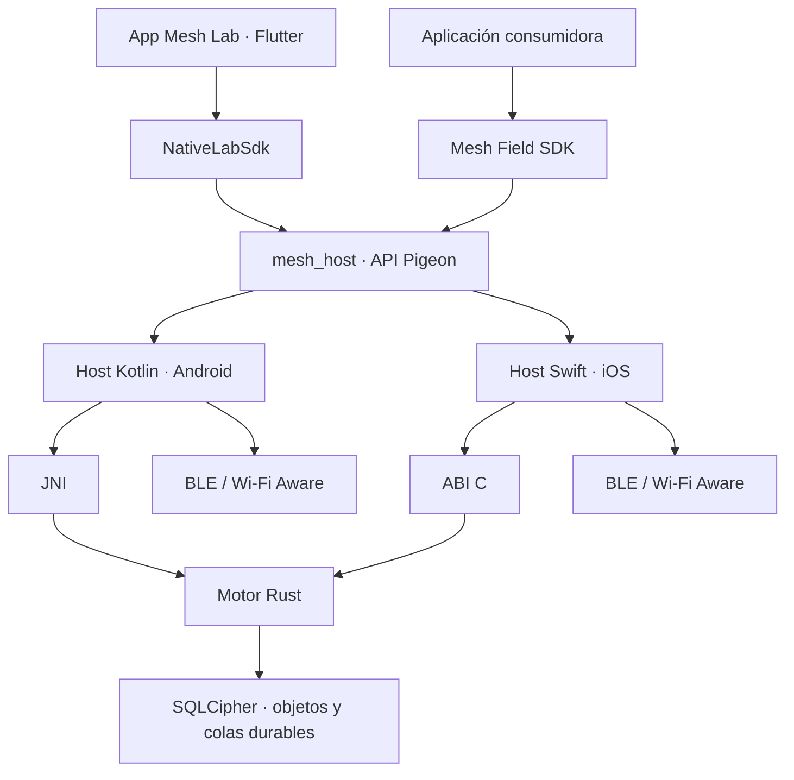
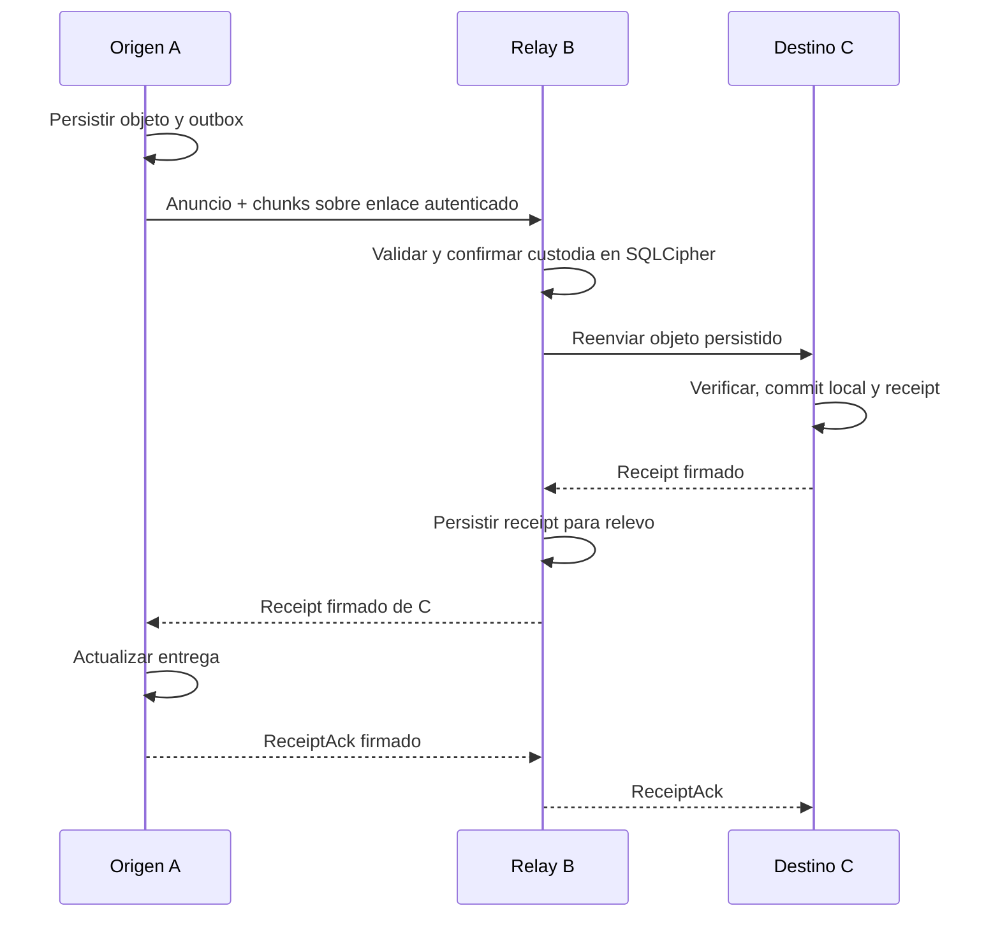

# Mesh Lab

Laboratorio móvil y núcleo de comunicación cercana para intercambiar **texto, ubicación y notas de voz entre teléfonos**, mediante enlaces autenticados y almacenamiento durable, sin exigir una conexión a Internet para el transporte local.

El proyecto reúne una aplicación Flutter de pruebas, hosts nativos Android/iOS, un motor Rust compartido y una fachada Flutter reutilizable: **Mesh Field SDK**. Otras aplicaciones pueden consumir esa infraestructura mediante el SDK.

**Estado documental: 25 de septiembre de 2026. Avance global estimado del plan Malla: 81%; Wi-Fi Aware: 90%; comunicación: 78%.** Son estimaciones del seguimiento, no porcentajes de cobertura de pruebas ni certificaciones de funcionamiento. Esta documentación no modifica esos gates. La evidencia física y los pendientes están en [docs/progress.md](docs/progress.md), especialmente en sus secciones recientes.

## Índice

1. [Qué es y qué problema resuelve](#1-qué-es-y-qué-problema-resuelve)
2. [Estado real y alcance](#2-estado-real-y-alcance)
3. [Arquitectura del sistema](#3-arquitectura-del-sistema)
4. [Identidad, grupos y seguridad](#4-identidad-grupos-y-seguridad)
5. [Descubrimiento, radios y sesiones](#5-descubrimiento-radios-y-sesiones)
6. [Entrega durable y múltiples saltos](#6-entrega-durable-y-múltiples-saltos)
7. [Tipos de contenido y límites](#7-tipos-de-contenido-y-límites)
8. [Preparación y compilación](#8-preparación-y-compilación)
9. [Cómo usar la aplicación](#9-cómo-usar-la-aplicación)
10. [Cómo integrar el SDK](#10-cómo-integrar-el-sdk)
11. [Pruebas y evidencia](#11-pruebas-y-evidencia)
12. [Diagnóstico de problemas](#12-diagnóstico-de-problemas)
13. [Mapa del repositorio](#13-mapa-del-repositorio)
14. [Pendientes y documentación de referencia](#14-pendientes-y-documentación-de-referencia)
15. [Glosario](#15-glosario)

## 1. Qué es y qué problema resuelve

Mesh Lab permite desarrollar y observar un sistema de comunicación entre dispositivos cercanos cuando la conexión a un servidor no está disponible o resulta intermitente. Cada teléfono puede originar contenido, recibirlo y, cuando el ejecutor y los enlaces lo permiten, custodiarlo y reenviarlo a otros miembros del grupo.

La palabra *mesh* describe la posibilidad de formar una red de vecinos y transportar contenido por varios saltos. No significa que todos los teléfonos estén conectados directamente entre sí. Tampoco convierte al teléfono en un punto de acceso general a Internet: el relevo de acciones a un servidor es otra función, con autorización, firma e idempotencia propias.

El repositorio tiene cuatro responsabilidades principales:

| Componente | Para qué sirve | Consumidor |
|---|---|---|
| Aplicación Mesh Lab | Operar los radios, enviar contenido y observar estados durante QA | Desarrollador o persona que prueba teléfonos |
| Motor Rust | Aplicar contratos, criptografía, persistencia y reglas de replicación | Hosts nativos |
| Plugin `mesh_host` | Unir Flutter con Rust y controlar las APIs del sistema operativo | App de laboratorio y SDK |
| `mesh_field_sdk` | Ofrecer operaciones de producto sin exponer topología ni claves | Aplicaciones consumidoras |

La app del laboratorio usa directamente `mesh_host` mediante `NativeLabSdk`. El SDK de producto también usa ese plugin mediante `MeshHostGateway`. Son dos consumidores de la misma infraestructura, con interfaces y reglas de presentación distintas.

Un ejemplo de uso es un grupo de vehículos: un integrante envía su posición o una nota de voz, un vecino la recibe por radio y el sistema registra qué destinatarios confirmaron el objeto. La interpretación como vehículo, chat, mapa o usuario pertenece a la aplicación consumidora; el motor trabaja con miembros certificados, objetos y recibos.

## 2. Estado real y alcance

El README anterior describía únicamente F0, la fundación del puente Flutter–Rust. Ese estado fue superado. F0 sigue siendo una capa comprobable, pero hoy existe código para grupos, radios, persistencia, contenido y adaptación a productos.

| Capacidad | Situación documentada | Límite de la evidencia |
|---|---|---|
| Puente Flutter → nativo → Rust | Implementado, con contratos y pruebas | Un puente correcto no prueba conectividad física |
| Identidad persistente | Android Keystore y Apple Keychain | No equivale a auditoría independiente de seguridad |
| Texto, GPS y voz bilateral | Implementados; uso confirmado por el usuario en una integración de producto con Android/iPhone | No certifica todas las combinaciones de OS y hardware |
| Enlace BLE autenticado | Implementado y observado físicamente | Campaña exhaustiva de cortes y reinicios pendiente |
| Wi-Fi Aware | Adaptadores y evidencia Android↔Android registrados | iPhone↔iPhone y regresión de producto pendientes |
| Relay durable | Núcleo, persistencia y ejecutores parciales | Falta campaña física reproducible A→B→C |
| Grupos de 50 miembros | Contratos acotados y pruebas sintéticas | No hay certificación con 50 radios reales |
| Segundo plano | Bases nativas implementadas | Continuidad, pantalla bloqueada y consumo por validar |
| Pasarela de producto → Internet | Código local de texto y pruebas registrados | Despliegue/E2E remoto y extensión a voz/GPS pendientes |

Las observaciones de la integración de producto documentadas en este repositorio corresponden al producto que consume el host. No deben atribuirse automáticamente a una build concreta de la aplicación Mesh Lab sin registrar esa build y repetir la prueba.

Los documentos F0/F1 conservan valor histórico. Cuando contradicen el estado actual, se debe consultar el código y las entradas más recientes de progreso. En particular, las afirmaciones antiguas de que no hay radio, texto o voz ya no describen este checkout.

## 3. Arquitectura del sistema



### 3.1 Flutter: intención y presentación

Flutter muestra estado y solicita operaciones. `LabController`, basado en `ChangeNotifier`, proyecta datos del host, gestiona el chat del laboratorio y consulta el progreso de entrega. La pantalla agrupa Red, GPS, Texto, Voz y Diagnóstico.

La UI no valida firmas ni decide que un objeto está entregado porque un botón terminó de ejecutarse. Consulta el estado producido por las capas inferiores. La app sí captura ubicación y graba audio mediante plugins: la separación nativa del motor no implica que todo procesamiento de contenido esté fuera de Dart.

El chat del laboratorio conserva una proyección en `shared_preferences`. Esa proyección no sustituye al outbox SQLCipher ni demuestra que toda copia de contenido visible tenga el mismo cifrado que el almacén del motor.

### 3.2 Pigeon y hosts nativos

El contrato fuente está en [mesh_api.dart](platforms/mesh_host/pigeons/mesh_api.dart). Pigeon genera bindings Dart, Kotlin y Swift; los tres deben mantenerse sincronizados.

Los hosts poseen recursos con ciclo de vida del sistema operativo: descubrimiento, conexiones, sockets, colas de escritura, claves protegidas, reproducción y acceso al motor. Android entra por JNI; iOS, por la ABI C y `MeshEngine.xcframework`.

Un hot restart de Dart no equivale a terminar el proceso nativo. El runtime diagnóstico y los recursos del host tienen un ciclo de vida diferente al árbol de widgets. Al cambiar código Rust hay que reconstruir las bibliotecas y relanzar la aplicación: hot reload no reemplaza código nativo.

### 3.3 Núcleo Rust

El workspace separa responsabilidades para probar reglas sin depender de radios:

| Crate | Responsabilidad |
|---|---|
| `mesh-types` | Identificadores, estructuras comunes y límites |
| `mesh-codec` | Codificación y decodificación, incluido CBOR canónico |
| `mesh-object` | Objetos, manifests y partición en chunks |
| `mesh-crypto` | Primitivas de firma, cifrado y protección de claves de entrega |
| `mesh-protocol` | Políticas, certificados, anuncios y recibos autenticados |
| `mesh-session` | Handshake Noise, autenticación y protección contra replay |
| `mesh-link` | Contratos y encuadre de enlace |
| `mesh-runtime` | Transiciones de estado de diagnóstico, envío y recepción |
| `mesh-store` | Persistencia SQLCipher, políticas y transacciones durables |
| `mesh-replication` | Vecinos, presencia, deduplicación y reglas de relay/transporte |
| `mesh-sim` | Escenarios sintéticos reproducibles |
| `mesh-ffi-c` / `mesh-ffi-jni` | Fronteras de interoperabilidad con Swift/Kotlin |

El motor no abre por sí solo un radio Bluetooth del teléfono. Produce y valida decisiones y registros; los hosts ejecutan las operaciones físicas.

## 4. Identidad, grupos y seguridad

### 4.1 Identidad de instalación

Cada instalación prepara cuatro materiales independientes de 32 bytes: identidad, entrega HPKE, clave estática de sesión Noise y clave de base de datos. Las semillas privadas no cruzan Pigeon hacia Flutter.

En Android, una clave AES-GCM de Android Keystore protege el material persistido en el directorio privado excluido de backup. En iOS, el material se guarda en Keychain con `AfterFirstUnlockThisDeviceOnly` y sin sincronización. Estas protecciones no significan que todas las operaciones Ed25519 o Noise ocurran dentro de hardware seguro: el host utiliza material en memoria para operar.

La propiedad pública denominada `fingerprint` representa actualmente la clave pública Ed25519 de 32 bytes, como 64 caracteres hexadecimales minúsculos. No es una contraseña ni un identificador de cuenta de la aplicación. El producto debe vincular explícitamente esa identidad criptográfica con su usuario autorizado.

### 4.2 Grupo, autoridad y época

Una política certificada identifica el grupo, su época y los miembros admitidos. El roster aporta las identidades que se aceptan al autenticar sesiones y objetos. La autoridad firma esa política; observar un anuncio de radio no basta para convertirse en miembro.

Mesh Lab conserva un modo experimental de incorporación abierta. La integración de producto añade una política de admisión con identidades públicas autorizadas por el producto. Son contextos de confianza distintos: la experiencia del laboratorio no debe copiarse como autorización de producción.

El SDK ofrece controles opcionales para configurar admisión y scope, consultar si la identidad local puede emitir incorporaciones y preparar un relevo de autoridad. El handoff firmado vincula al sucesor con la siguiente época; no se acepta simplemente una clave nueva como autoridad. La migración completa de liderazgo de producto, distribución y ACKs aún tiene gates operativos abiertos.

El scope de producto es un identificador hexadecimal de 128 bits. Los hosts separan el almacenamiento por scope mediante `mesh-store/<scope>/state-v1.db`. El cambio de grupo exige cerrar la sesión anterior y limpiar su política activa. Conservar una base cifrada de otro scope no la convierte en el grupo de radio actual.

### 4.3 Autenticación del enlace

El perfil implementado es `Noise_XX_25519_ChaChaPoly_SHA256`. El handshake XX establece material de sesión; después ambos extremos deben producir y verificar una prueba AUTH Ed25519 vinculada al transcript, grupo, época, miembro y rol.

El hash del handshake se usa como identificador de sesión. El prologue CBOR canónico incorpora el grupo y la época. Así, la autenticación no se basa sólo en que un dispositivo remoto haya contestado por Bluetooth.

El [perfil de sesión](schema/session/lab-v1.md) especifica:

- Tres mensajes de handshake con payload vacío y tamaños de 32, 96 y 64 bytes.
- Plazo de handshake de 30 segundos en el módulo de sesión.
- Payload de aplicación de hasta 4096 bytes por registro de sesión.
- Frame con versión, ID de sesión de 32 bytes, número de paquete `u64` y ciphertext.
- Ventana antireplay de 64 paquetes por dirección.
- Contadores de datos desde 1 y menores que `2^20`.
- Reconexión mediante un XX nuevo, con entropía y espacio de contadores nuevos.

El contador sólo avanza en recepción tras validaciones satisfactorias. Un paquete alterado no puede adelantar la ventana. El nonce de un emisor no se rebobina para retransmitir contenido.

### 4.4 Protección de objetos

La protección del enlace y la del objeto cumplen funciones diferentes. Noise protege el salto entre vecinos. El protocolo de objetos firma el origen y protege el contenido para su audiencia, de modo que la persistencia y los recibos siguen siendo verificables al atravesar relays.

El proveedor usa Ed25519, HPKE con X25519/HKDF-SHA256/ChaCha20-Poly1305 y cifrado autenticado de chunks. Los dominios de firma separan certificados, objetos, recibos, autenticación de sesión, handoffs y pruebas de relevo a nube.

No se declara auditoría criptográfica independiente, borrado perfecto de todas las copias en memoria ni seguridad de producción certificada. Los rechazos y pruebas del repositorio son evidencia de implementación, no sustitutos de esa auditoría.

## 5. Descubrimiento, radios y sesiones

### 5.1 Bluetooth LE

BLE proporciona descubrimiento, incorporación y transporte autenticado. Los hosts fragmentan los registros según las restricciones de GATT/ATT y mantienen colas para no mezclar fragmentos ni alterar el orden de cifrado.

La salud del enlace se comprueba con respuestas autenticadas y reloj monótono: la implementación registra sondeos cada 3 segundos y vencimiento después de 12 segundos sin prueba válida. Una escritura aceptada por el sistema operativo no renueva por sí sola la vida del vecino.

Los registros públicos de incorporación tienen un dominio versionado de 128 bits. Esto evita confundir un registro opaco Noise con un mensaje de incorporación por la coincidencia de un solo byte, fallo encontrado durante la campaña física.

### 5.2 Wi-Fi Aware

Wi-Fi Aware aporta descubrimiento y enlaces directos en equipos compatibles. El flujo de usuario no requiere introducir router, hotspot, SSID ni IP. El host sí maneja primitivas de red y sockets internamente; no se trata de una ausencia de IP en todas las capas.

Android debe disponer de soporte del dispositivo, APIs y permisos correspondientes. El adaptador iOS verifica iOS 26 o posterior, capacidades del hardware y disponibilidad de la integración. La firma y el entitlement de Wi-Fi Aware condicionan qué puede abrir una build real. El mínimo de compilación iOS 15 no garantiza Wi-Fi Aware.

El plan de vecinos limita a dos candidatos Aware directos por nodo y deriva el overlay del roster certificado. El núcleo contempla predecesor/sucesor y un enlace BLE adicional en determinadas topologías. La sustitución física de vecinos fuera de alcance y la convergencia bajo cortes no están certificadas por esa regla matemática.

### 5.3 Estados que deben distinguirse

Un radio disponible, un peer descubierto, un enlace autenticado y una entrega confirmada son hechos diferentes. La UI o un producto deben conservar esa distinción:

1. El equipo tiene el radio y los permisos.
2. El host descubre un candidato.
3. La sesión valida Noise y la identidad certificada.
4. El transporte queda listo para contenido.
5. Un objeto entra al outbox.
6. Sus destinatarios emiten recibos válidos.

Que Wi-Fi Aware esté pendiente no debe bloquear un enlace BLE utilizable. A la inversa, una conexión visible en el sistema no debe presentarse como una sesión segura sin autenticación.

## 6. Entrega durable y múltiples saltos

### 6.1 Del envío al recibo

El envío pasa por una secuencia verificable:

1. La aplicación aporta contenido y un ID lógico, o el SDK genera ese ID.
2. El host solicita crear los objetos necesarios para la audiencia certificada.
3. Rust valida, firma, sella y persiste el contenido y su operación en SQLCipher.
4. El ejecutor lee el outbox y emite registros por enlaces autenticados.
5. El receptor valida el anuncio antes de aceptar los chunks.
6. Al completar el objeto, verifica el contenido y confirma su entrega local y receipt.
7. El origen valida los recibos y actualiza el resumen de la acción lógica.
8. Un `ReceiptAck` firmado por el origen permite detener el reintento del receipt correspondiente.



El diagrama representa el contrato durable. Su existencia en código y pruebas FFI no certifica todavía esa topología completa sobre tres radios físicos.

### 6.2 Custodia y recuperación

Un relay debe persistir antes de reenviar. El commit del último chunk y la custodia asociada deben ser consistentes; un buffer RAM no reemplaza la cola durable. Al volver un enlace, los ejecutores drenan las colas de objetos, receipts y ACKs que correspondan.

`received_from` identifica al vecino autenticado que entregó el registro. El reenvío debe excluirlo y actualizar la información del salto. Hay límites de saltos y deduplicación para evitar circulación ilimitada. El TTL del contenido y el presupuesto de saltos son controles distintos.

El ejecutor Android contempla BLE/WFA autenticados. La documentación del ejecutor mantiene pendiente el relay iOS hacia un vecino WFA individual con exclusión precisa de entrada. También queda integrar completamente la selección común por objeto y validar el failover físico. Véase [relay-host-executor.md](docs/relay-host-executor.md).

### 6.3 Estados de entrega

La fachada del SDK expone estos estados agregados:

| Estado | Interpretación |
|---|---|
| `queued` | Acción admitida en la cola; todavía sin confirmación completa |
| `partial` | Parte de la audiencia confirmó |
| `delivered` | La audiencia requerida confirmó mediante recibos válidos |
| `expired` | Venció sin completar la entrega requerida |

El contrato interno de relay también distingue conceptos como `custodied` y `no_route`. No deben confundirse con el enum público del SDK.

El éxito de `sendText`, una escritura GATT o el cierre de un socket no demuestra `delivered`. Tampoco equivale un receipt mesh al ACK de un servidor de la aplicación: cada vía conserva su propia evidencia.

### 6.4 Acción lógica y objetos físicos

El grupo permite hasta 50 miembros certificados, pero un objeto protegido admite hasta 10 destinatarios. El envío de grupo distribuye una acción lógica en objetos de audiencia acotada y agrega sus recibos. Por eso el ID lógico del mensaje y el ID de cada objeto no son intercambiables.

Un miembro que se incorpora posteriormente no recibe automáticamente todo el historial previo. La audiencia se define en el envío; la entrada al grupo no implica acceso retroactivo general a mensajes anteriores.

## 7. Tipos de contenido y límites

| Nivel | Límite o formato actual | Fuente principal |
|---|---|---|
| Grupo | 50 miembros certificados | `mesh-types/src/durable.rs` |
| Objeto protegido | 10 destinatarios como máximo | `mesh-types/src/durable.rs` |
| Chunk durable | 1024 bytes | `mesh-types/src/durable.rs` |
| Objeto de almacenamiento | 64 KiB y hasta 64 chunks | `mesh-types/src/durable.rs` |
| Plaintext del protocolo | 48 KiB | `mesh-protocol/src/lib.rs` |
| Registro de aplicación Noise | Hasta 4096 bytes | Perfil de sesión |
| Texto por SDK | Sobre codificado de hasta 2048 bytes UTF-8 | `field_mesh_client.dart` |
| Voz por SDK | Hasta 10 s y 47 KiB de audio codificado | `field_mesh_client.dart` |
| Contexto de voz SDK | Hasta 512 bytes UTF-8 cuando se aporta | `field_mesh_client.dart` |
| Voz en Mesh Lab | Hasta 8 s, AAC-LC/M4A, mono, 16 kHz, 24 kb/s | `lab_screen.dart` |
| ID lógico aportado al SDK | 32 caracteres hexadecimales minúsculos | `field_mesh_client.dart` |
| ID de objeto para reproducción | 64 caracteres hexadecimales minúsculos | `field_mesh_client.dart` |
| Relay | Hasta 16 saltos; deduplicación acotada a 512 entradas | `mesh-replication/src/lib.rs` |

Los límites pertenecen a capas diferentes. Un máximo de almacenamiento no es una promesa de que cualquier payload de ese tamaño sea admitido por la UI. UTF-8 se mide en bytes: emojis, metadata y sobres consumen presupuesto aunque el texto visible parezca corto.

**Texto.** El laboratorio envuelve el mensaje con ID y timestamp híbrido para su chat. El SDK usa su propio sobre de acción para conservar el ID lógico dentro del contenido protegido. Compartir host no implica que todos los sobres de aplicación sean intercambiables.

**Ubicación.** Mesh Lab solicita una fijación puntual mediante geolocalización y la envía por el carril durable de contenido. `FieldLocation` aporta coordenadas, precisión, instante y orientación opcional. Una posición recibida puede ser antigua: el producto debe conservar su fecha y decidir cuándo mostrarla como obsoleta. El SDK no ofrece por sí solo rastreo continuo global en segundo plano.

**Voz.** Son notas completas, no llamadas en tiempo real. El laboratorio graba, lee el archivo comprimido y lo entrega al host. La recepción certificada del SDK identifica el objeto y permite reproducirlo por ID desde almacenamiento privado, sin entregar una ruta o bytes de audio al producto receptor.

## 8. Preparación y compilación

### 8.1 Toolchain del repositorio

Las versiones siguientes provienen de archivos de configuración y CI del proyecto; no pretenden identificar las versiones más recientes publicadas por sus fabricantes.

| Herramienta | Versión/configuración |
|---|---|
| Flutter | 3.47.2, en `.flutter-version` |
| Dart | Restricción `^3.13.2` en los pubspec |
| Rust | 1.98.1, en `rust-toolchain.toml` |
| Android NDK | 28.2.13676358 |
| JDK | 21 |
| Gradle / AGP / Kotlin | 9.3.1 / 9.1.0 / 2.4.0 |
| Xcode | Evidencia histórica local con 26.4.1 |
| Python | Python 3 para herramientas del repositorio |

Los targets nativos son Android ARM64/x86_64 e iOS ARM64 físico y ARM64/x86_64 de simulador. Los mínimos iniciales de compilación son Android API 24 e iOS 15. El soporte de cada radio requiere comprobaciones adicionales en ejecución.

Se necesita macOS con Xcode para construir Apple. Android requiere el SDK/NDK fijado; `build_native.py` consulta `ANDROID_HOME` y, si no existe, usa `~/Library/Android/sdk`. Los compiladores C son necesarios porque SQLCipher y su proveedor criptográfico se compilan junto con Rust.

### 8.2 Construir las bibliotecas

Desde la raíz del repositorio:

```sh
export PATH="$HOME/.cargo/bin:$PATH"
python3 tools/build_native.py all
```

Se puede sustituir `all` por `apple` o `android`. El script añade targets Rust y produce:

- Apple: `platforms/mesh_host/ios/mesh_host/MeshEngine.xcframework`.
- Android: `platforms/mesh_host/android/src/main/jniLibs/<abi>/libmesh_ffi_jni.so`.

Los binarios son artefactos locales ignorados por Git. Un checkout nuevo debe generarlos antes de compilar Flutter. La reconstrucción también es necesaria después de modificar Rust.

### 8.3 Resolver dependencias y ejecutar

```sh
cd app
flutter pub get --enforce-lockfile
flutter devices
flutter run --release -d <device-id>
```

Reemplazar `<device-id>` por el identificador real. Para simuladores y desarrollo de UI se puede usar `flutter run -d <simulator-id>`, pero la campaña física usa builds Release de la app normal.

Compilación de paquetes desde `app/`:

```sh
flutter build apk --release --target-platform android-arm64,android-x64
flutter build ios --release
```

El APK se produce en `app/build/app/outputs/flutter-apk/app-release.apk`, relativo a la raíz del repositorio. La build iOS exige firma válida para instalar en un teléfono. `flutter build ios --release --no-codesign` permite comprobar compilación sin producir una app directamente instalable firmada.

No instalar el runner instrumental sobre la app durante una campaña normal de uso. Los tests instrumentales tienen su propio procedimiento y pueden reemplazar el entry point.

## 9. Cómo usar la aplicación

### 9.1 Primera sesión con dos teléfonos

La ruta visible de creación del grupo en la app de laboratorio parte de Android.

1. Instalar una build Release actual en ambos teléfonos y abrir Mesh Lab.
2. Entrar a **Diagnóstico → Preparar identidad** en cada equipo. Comprobar que hay huella pública y almacenamiento protegido.
3. En el Android que será la autoridad inicial, ir a **Red → Crear grupo nuevo**.
4. Tocar **Conectar sesión** en ese Android.
5. En el segundo Android, usar **Buscar grupo cercano**. En iPhone, mantenerlo cerca del Android creador y usar la búsqueda disponible mientras no tenga grupo.
6. Conceder los permisos solicitados y comprobar los detalles de Bluetooth y Wi-Fi Aware en Red.
7. Esperar incorporación y enlace autenticado. No considerar suficiente el contador de dispositivos detectados.
8. Enviar primero un texto breve en cada dirección y revisar su estado de entrega.

Crear grupos separados en los dos teléfonos no los convierte en miembros de un mismo grupo. La segunda instalación debe incorporarse a la política del primero.

Si ya existe un grupo persistido, preparar identidad recupera su estado. No hace falta crear uno nuevo en cada apertura. El resultado observable en Red determina si se requiere conectar o esperar recuperación.

### 9.2 Pantalla Red

Muestra grupo, sesión y detalles de radios. **Conectar sesión** inicia búsqueda BLE y Aware; **Salir de sesión** detiene esas búsquedas y los reintentos asociados. Salir no equivale a borrar la identidad o desinstalar la aplicación.

Una función no disponible debe leerse junto a su motivo: permisos, hardware, versión del sistema, política o estado de conexión. No todas las builds iOS tienen la misma capacidad de Wi-Fi Aware aunque compartan la UI.

### 9.3 Pantalla Texto

Escribir un mensaje y pulsar **Enviar** con enlace seguro disponible. La entrada al chat significa que la operación fue admitida en la cola. Consultar el contador de confirmaciones y el estado hasta entrega, parcialidad o vencimiento.

La fachada y el laboratorio actualmente comprueban conexión segura antes de admitir determinados envíos. La persistencia permite recuperar contenido ya admitido; no debe deducirse que la UI permite componer y encolar todo tipo de mensaje sin ningún vecino conectado.

### 9.4 Pantalla GPS

Pulsar **Compartir mi ubicación**, autorizar ubicación y esperar una fijación válida. Revisar coordenadas y fecha de actualización. El receptor muestra la ubicación compartida por el otro teléfono.

Una prueba interior sin fijación GPS no valida este flujo. Probar con señal suficiente y registrar el instante original para distinguir una posición nueva de una entrega retrasada.

### 9.5 Pantalla Voz

Con enlace seguro, usar el control de grabación y conceder micrófono. El laboratorio detiene automáticamente a los 8 segundos. Al finalizar, el audio se incorpora al envío durable. En el receptor, usar **Reproducir última nota** cuando el host indique que está lista.

La duración máxima de 10 segundos del SDK no cambia el límite de 8 segundos de esta pantalla. La calidad y latencia dependen del enlace y de la cola pendiente.

### 9.6 Pantalla Diagnóstico

Permite preparar o recuperar identidad y consultar motor, contrato ABI/API, instancia del proceso, secuencia y compilación. **Verificar puente** comprueba la llamada hasta Rust; **Recuperar estado** consulta snapshots.

El estado diagnóstico de proceso y el almacén durable son distintos. Un proceso nuevo puede tener otra instancia diagnóstica y conservar identidad, política y colas persistentes. Borrar datos o desinstalar altera esa prueba y puede destruir material necesario para recuperar el almacén.

## 10. Cómo integrar el SDK

El paquete local es `packages/mesh_field_sdk`, versión declarada `0.2.5`, con `publish_to: none`. Se integra mediante dependencia de ruta adecuada al checkout del producto. No hay que asumir una publicación en un registro público.

### 10.1 Inicio y envío

Este ejemplo supone que la aplicación ya resolvió la pertenencia al grupo. Crear un grupo automáticamente en cada producto o cada apertura sería incorrecto.

```dart
import 'package:mesh_field_sdk/mesh_field_sdk.dart';

Future<FieldDelivery?> enviarTexto(FieldMeshClient mesh) async {
  await mesh.prepareIdentity();
  final group = await mesh.groupInfo();
  if (!group.configured) {
    // Resolver creación o incorporación según la política del producto.
    return null;
  }

  // connect inicia la búsqueda; no espera necesariamente autenticación.
  final session = await mesh.connect();
  if (!session.secure) return null;

  final delivery = await mesh.sendText('Punto de reunión confirmado');
  // Conservar delivery?.logicalId para consultar mesh.delivery(id).
  return delivery;
}
```

La aplicación puede observar `mesh.watch()` y habilitar envíos cuando el estado sea seguro. `watch()` consulta periódicamente el host —un segundo por defecto— y emite cambios; no es una suscripción push directa al radio. Debe cancelarse la suscripción al terminar su propietario.

### 10.2 IDs, recepción y entrega

Si el producto ya tiene una acción persistida, usar `sendTextWithLogicalId`, `sendLocationWithLogicalId` o las variantes de voz. El ID aportado debe tener 32 caracteres hexadecimales minúsculos. Un UUID con guiones requiere conversión explícita en el adaptador y conservación de su correspondencia.

Guardar el ID lógico y consultar `delivery(id)` para actualizar el outbox del producto. Un retorno nulo debe tratarse como operación no admitida o sin resultado disponible, según la operación; no como entrega exitosa.

Para atribuir acciones entrantes, usar `watchVerifiedIncomingText()` y `watchVerifiedIncomingVoice()`. Estas capacidades consumen colas nativas de objetos verificados y aportan origen certificado, ID de objeto e instante, además de los datos propios del contenido. El SDK vuelve a validar su formato.

`watchIncoming()` es una proyección simplificada basada en el último mensaje y su contador. No reemplaza una cola certificada para productos que necesitan conservar ráfagas, atribución y reconciliación. Las colas certificadas también son acotadas: el consumidor debe drenarlas y persistir lo necesario para su producto.

La aplicación debe validar que el origen certificado corresponde a un miembro autorizado de su dominio, deduplicar la acción y manejar conflictos. El nombre visible de un usuario no sustituye ese vínculo.

### 10.3 Capacidades de producto

| Capacidad | Uso |
|---|---|
| `FieldMeshEnrollmentAccessController` | Instalar roster autorizado y scope de producto |
| Operaciones de handoff de `FieldMeshClient` | Preparar relevo, rotar autoridad y aplicar política autorizada |
| `FieldMeshCloudRelaySigner` | Firmar contenido canónico para relevo autorizado a nube |
| `FieldMeshVerifiedIncomingSource` | Recibir acciones de texto/ubicación con evidencia de origen |
| `FieldMeshVerifiedIncomingVoiceSource` | Recibir notas de voz verificadas por objeto |
| `FieldMeshVoiceContextSender` | Sellar contexto de producto junto al audio |

`playVerifiedVoice(objectId)` reproduce el objeto privado correspondiente. No basar el historial de voz de un producto sólo en “última nota”, porque dos objetos pueden recibirse fuera del orden visual esperado.

`FieldMeshGateway` permite sustituir el host por un fake en pruebas de producto. Ese fake no constituye evidencia de radio, permisos o persistencia real.

### 10.4 Internet y malla en una aplicación consumidora

La aplicación consumidora decide cómo vincular participantes, historial, posiciones y autoridad. Puede conservar presencia cercana mientras utiliza Internet y reconciliar acciones por su ID lógico. El servidor sigue teniendo su propio ACK y controles de acceso.

La pasarela certificada firma un sobre canónico ligado a grupo y época sin exponer semillas. El registro reciente documenta cola local y validación de texto para relevo al servidor; despliegue y E2E remoto siguen pendientes. Tener la capacidad `signCloudRelay` no habilita por sí solo una pasarela operativa.

## 11. Pruebas y evidencia

### 11.1 Validación del motor y herramientas

Desde la raíz:

```sh
cargo fmt --all -- --check
cargo clippy --workspace --all-targets --all-features --locked -- -D warnings
cargo test --workspace --locked
python3 tools/test_f1.py
python3 tools/test_f1_crypto_runtime.py
python3 tools/check_contracts.py
python3 -m unittest discover -s tools/tests -v
```

Los escenarios F1 ejercitan almacenamiento, criptografía y recuperación en host. Sus informes no deben etiquetarse como pruebas entre teléfonos.

### 11.2 Flutter y contrato generado

Resolver dependencias dentro de cada paquete antes de sus checks:

```sh
(cd platforms/mesh_host && flutter pub get --enforce-lockfile && flutter analyze)
python3 tools/check_pigeon.py
(cd packages/mesh_field_sdk && flutter pub get --enforce-lockfile && flutter analyze && flutter test)
(cd app && flutter pub get --enforce-lockfile && flutter analyze && flutter test)
```

`check_pigeon.py` regenera los tres bindings y compara sus hashes. Puede modificar archivos si detecta divergencia; hay que revisar el diff y mantenerlos sincronizados con el contrato fuente.

### 11.3 Hosts nativos

```sh
sh tools/test_apple_host.sh
cargo build --locked -p mesh-ffi-jni
(cd app/android && ./gradlew :mesh_host:testDebugUnitTest :mesh_host:assembleRelease)
```

Configurar `JAVA_HOME` al JDK 21 antes de invocar Gradle directamente. Las unidades JVM cargan una biblioteca Rust del host; no ejecutan el `.so` Android dentro de un teléfono.

La CI declarada en [.github/workflows/foundation.yml](.github/workflows/foundation.yml) incluye contratos, suites y builds. También declara un umbral de 90% para líneas nuevas instrumentadas Rust/Dart en PR. No implica 90% de cobertura de callbacks nativos ni una ejecución remota aprobada en esta revisión documental.

### 11.4 Campaña física reproducible

Para cada ejecución registrar commit/build, modelos, OS, permisos, radios, grupo/época, topología, hora y resultado. La progresión de QA es:

1. Dos teléfonos: incorporación y autenticación, texto en ambos sentidos, GPS válido y voz.
2. Recuperación: apagar radio, salir de alcance, cerrar un proceso y volver sin Internet.
3. Tres teléfonos: A→B→C sin enlace directo A↔C; reiniciar B y observar recuperación.
4. Verificar recibos, ausencia de duplicados y fechas originales del contenido.
5. Segundo plano/pantalla bloqueada y medición de consumo.
6. Grupos mayores y matriz de hardware, incluida la campaña Aware iPhone↔iPhone.

La ausencia de enlace A↔C debe demostrarse: separar visualmente los teléfonos no basta para concluir que existieron múltiples saltos. No declarar el gate aprobado únicamente porque C recibió el mensaje.

Los comandos de esta sección son instrucciones de reproducción. No se ejecutó toda esta campaña al redactar el README; los resultados previos permanecen en el registro de progreso y artefactos correspondientes.

## 12. Diagnóstico de problemas

| Síntoma | Qué revisar |
|---|---|
| Flutter no encuentra una biblioteca nativa | Ejecutar `build_native.py` para la plataforma y reconstruir la app |
| Cambios Rust no aparecen | Reconstruir XCFramework/JNI y relanzar el proceso; hot reload no basta |
| Se descubren teléfonos pero no hay sesión segura | Grupo/época, incorporación, identidad certificada, permisos y logs de Noise |
| Cada teléfono tiene grupo pero no se autentican | Comprobar que no se crearon dos grupos independientes |
| iPhone muestra Aware no disponible | Versión de iOS, capacidad de hardware, entitlement y firma del artefacto instalado |
| Queda “Conectando” después de un reinicio | Revisar cierre de GATT, vencimientos y nueva autenticación; no confiar en un vecino antiguo |
| Texto aparece en cola sin entrega | Enlaces autenticados, audiencia, receipts y vencimiento; escritura local no equivale a ACK |
| Texto corto se rechaza | Medir el sobre completo en UTF-8, incluidos metadata y emojis |
| GPS no cambia | Permisos, servicio de ubicación, fijación válida y timestamp original |
| Voz no se envía | Micrófono, duración, tamaño codificado, enlace seguro y cola de salida |
| Fallo de clave o store tras borrar datos | No recrear silenciosamente una identidad sobre un almacén previo; revisar la consistencia de instalación |
| Gradle usa otra JVM | Revisar JDK 21 y `JAVA_HOME` para comandos directos |

Conservar logs del host y del motor junto con la build usada. No incluir semillas, claves de base de datos ni material privado en informes de diagnóstico. La exportación completa de diagnóstico sigue siendo un pendiente de cierre.

## 13. Mapa del repositorio

```text
mesh_lab/
├── app/                         # Aplicación Flutter de laboratorio
│   ├── lib/core/sdk/             # Controlador y adaptador NativeLabSdk
│   └── lib/features/laboratory/  # Pantallas de uso y diagnóstico
├── packages/mesh_field_sdk/      # Fachada Flutter para productos
├── platforms/mesh_host/          # Plugin, contrato Pigeon y hosts nativos
│   ├── pigeons/                 # Fuente del contrato
│   ├── android/                 # Kotlin, JNI y radios Android
│   └── ios/                     # Swift, ABI C y radios Apple
├── crates/                      # Workspace Rust
├── schema/                      # API, protocolo, sesión, store y telemetría
├── vectors/                     # Vectores de conformidad y sesión
├── tools/                       # Builds, contratos, cobertura y evidencia
├── docs/                        # Diseño, seguimiento, pruebas y pendientes
└── .github/workflows/           # Definición de CI
```

Los HTML de arquitectura en la raíz conservan la especificación y el plan de diseño. Una capacidad descrita allí puede ser una meta; su presencia en la especificación no demuestra que esté implementada.

## 14. Pendientes y documentación de referencia

El cierre del plan mantiene abiertos, entre otros, estos trabajos:

- Campaña de tres teléfonos y múltiples saltos reales para texto, voz y GPS.
- Recuperación sin Internet, cortes/reencuentro y reinicios medidos.
- Segundo plano, pantalla bloqueada y consumo.
- Pasarela a nube: despliegue, E2E real y extensión más allá de texto.
- Sustitución de vecinos, selección física por objeto y presencia propagada.
- Grupos físicos de 5/10/50 y Wi-Fi Aware entre iPhones compatibles.
- Aislamiento al cambiar de grupo, membresía y liderazgo bajo cortes.
- Diagnóstico/exportación, cobertura nativa y auditoría independiente de seguridad.

| Documento | Uso y vigencia |
|---|---|
| [Progreso](docs/progress.md) | Registro de evidencia; priorizar entradas recientes |
| [Huecos conocidos](docs/known-gaps.md) | Inventario técnico; cruzar estados históricos con progreso |
| [Ejecutor durable](docs/relay-host-executor.md) | Custodia, relay y pendientes de hosts |
| [Perfil Noise](schema/session/lab-v1.md) | Formato exacto y límites de la sesión implementada |
| [SDK](packages/mesh_field_sdk/README.md) | Introducción a la fachada; algunas referencias de integración son históricas |
| [Contrato de fundación](docs/foundation-contract.md) | Frontera diagnóstica F0 |
| [Plan de cierre SDK](docs/sdk-closure-and-product-integration-plan.md) | Gates de producto y seguridad |
| [Internet y malla](docs/hybrid-internet-mesh-plan.md) | Diseño híbrido; no es constancia de despliegue |
| [Wi-Fi Aware mesh](docs/wifi-aware-mesh-50.md) | Diseño de grupos y topología acotada |
| [Validación Aware](docs/wifi-aware-validation-plan.md) | Matriz y campaña de radio |
| [Cobertura](docs/testing-coverage.md) | Alcance de mediciones y pruebas |
| [Pruebas móviles históricas](docs/mobile-testing.md) | Evidencia/procedimientos F0; su apertura no describe las funciones actuales |

El workspace Rust y los paquetes Flutter se mantienen sin publicación en registros. Este README no declara una licencia global nueva ni una release de distribución; las licencias específicas presentes deben revisarse antes de redistribuir.

## 15. Glosario

| Término | Significado en el proyecto |
|---|---|
| Host | Código nativo Swift/Kotlin que posee recursos y ejecuta operaciones del sistema |
| Peer o vecino | Dispositivo directamente observable/conectable por un enlace |
| Miembro | Identidad admitida por la política certificada del grupo |
| Roster | Conjunto certificado de miembros |
| Época | Versión de autoridad/política utilizada para validar pertenencia |
| Scope | Separación de datos y sesión de un grupo de producto |
| Objeto | Unidad durable con manifest, contenido y audiencia |
| Chunk | Fragmento acotado de un objeto |
| Outbox | Cola persistente de contenido pendiente de entrega |
| Custodia | Responsabilidad durable de conservar/reintentar un objeto o comprobante |
| Receipt | Confirmación firmada y verificable del receptor |
| ReceiptAck | Confirmación del origen sobre un receipt concreto |
| Relay | Nodo que reenvía contenido o comprobantes entre vecinos |
| ID lógico | Identificador de una acción de producto, incluso si usa varios objetos |
| Noise XX | Protocolo de establecimiento de claves del enlace, completado aquí con AUTH |
| Gate | Requisito de evidencia que debe cumplirse antes de declarar cierre |
