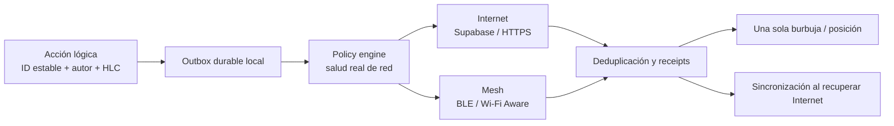

# Plan híbrido: Internet + Mesh como continuidad de Convoy

**Estado:** diseñado. No implementado. Forma parte del cierre operativo del SDK.

## Decisión

Convoy debe usar **un plano de acciones lógico** y dos transportes:

- **Internet:** Supabase, HTTPS y realtime cuando la conexión realmente responde.
- **Mesh cercano:** BLE y Wi-Fi Aware autenticados cuando hay miembros del grupo
  al alcance, aunque Internet esté caído o sea demasiado lento.

No se crean dos mensajes distintos. Cada acción obtiene una sola identidad
estable antes de salir del teléfono. Internet y mesh pueden transportar esa
misma acción, y el receptor o servidor la deduplica por esa identidad.

## No confiar en el icono de red

El estado se calcula por resultados observados, no por Wi-Fi, barras celulares
o `isConnected`:

| Estado | Evidencia | Política |
|---|---|---|
| Saludable | ACK autenticado del servidor, RTT y pérdida dentro del SLO | Internet es la ruta preferida; mesh queda listo para la sesión local. |
| Degradado | ACK lento, timeouts parciales, pérdida o cola que crece | Internet continúa con backoff; acciones críticas se duplican hacia mesh si hay vecino autenticado. |
| Sin ruta | No hay ACK del servidor dentro de la ventana | Mesh es la ruta primaria; el outbox conserva la acción para sincronizar después. |
| Recuperando | Vuelven ACKs, pero aún hay cola | Reconciliar en lotes idempotentes; evitar descargas y subidas masivas simultáneas. |

Cada teléfono hace esta evaluación independientemente. No se espera que todos
pierdan Internet a la vez.

## Política por tipo de dato

| Tipo | Modelo lógico | Uso de Internet y mesh |
|---|---|---|
| Chat | Evento inmutable con ID lógico, HLC y autor | Internet primero si está sano; mesh como fallback o ruta paralela en degradación. Nunca mostrar dos burbujas. |
| Voz | Objeto durable, fragmentado y acotado | Preferir Internet sano; enviar por mesh cuando no haya ACK o se trate de alerta/PPT prioritaria. El recibo confirma la misma acción. |
| Ubicación + rumbo | Estado de corta vida, no historial | Enviar la lectura más reciente; reemplazar lecturas viejas pendientes. Durante recuperación, subir sólo el último estado válido. |
| Presencia | Señal efímera | Mostrar presencia local por mesh y presencia remota por Internet como fuentes distintas; no afirmar que todo el grupo está conectado localmente. |

## Regla de duplicación controlada

Ambos transportes no deben transmitir todo dos veces todo el tiempo. Eso
agotaría batería, radio y datos. La política será:

1. Con Internet saludable, enviar por Internet y mantener mesh en descubrimiento
   o enlace local según la sesión de convoy activa.
2. Con Internet degradado, duplicar sólo acciones prioritarias o cuando no haya
   ACK remoto dentro de su presupuesto de tiempo.
3. Sin Internet, enviar por mesh y conservar la misma acción en el outbox.
4. Al recuperar Internet, sincronizar por ID lógico. El servidor acepta una
   acción ya conocida como éxito idempotente, no como duplicado.
5. Una evidencia de entrega mesh y una confirmación del servidor se muestran
   como alcances distintos: “entregado al grupo cercano” no significa “guardado
   en Convoy remoto”, y viceversa.

## Sincronización de regreso

El sincronizador no reproduce ciegamente toda la base local.

- **Chat y voz:** intercambia IDs y resúmenes primero; solicita sólo acciones
  faltantes, conserva orden por HLC y usa autor + ID para dedupe.
- **Ubicación:** aplica latest-valid-state por miembro; descarta posiciones
  vencidas y no recrea la ruta completa desde el outbox mesh.
- **Recibos:** conserva evidencia mesh local y reporta al servidor sólo el
  resumen permitido por la política de producto.
- **Conflictos:** un mensaje inmutable nunca se reemplaza. Cambios editables
  requieren versión y actor. Las posiciones sólo compiten dentro de la ventana
  de frescura definida.
- **Bajo ancho de banda:** usa prioridades, lotes pequeños, compresión donde
  corresponda, límite de concurrencia uno y backoff exponencial con jitter.

## Responsabilidades por capa

| Capa | Responsabilidad |
|---|---|
| Convoy | Prioridad de acción, UI, autorización de sesión y política de retención. |
| Adaptador híbrido de Convoy | Mantiene el outbox lógico, mide salud remota y ejecuta la política de rutas. |
| Mesh Field SDK | Envía/recibe acciones cercanas, expone evidencia local y nunca conoce Supabase. |
| Cliente remoto Convoy | Sincroniza acciones idempotentes, confirma persistencia y entrega remota. |
| Servidor | Deduplica por ID lógico + autor, ordena por HLC y devuelve ACK verificable. |

## Gates antes de implementación

1. Definir SLO de ACK, prioridades y presupuesto de duplicación por tipo de
   acción.
2. Alinear el ID lógico actual del SDK con el ID idempotente remoto de Convoy;
   no generar un ID nuevo por transporte.
3. Implementar outbox híbrido con pruebas de Internet sano, degradado, caído y
   recuperado en momentos distintos en cada teléfono.
4. Probar A→B por mesh mientras A conserva Internet y B no; luego sincronizar
   B al volver Internet sin duplicar chat ni ubicación.
5. Medir batería, datos, latencia y tamaño de cola en 5/10/50 equipos.
6. Publicar en UI el alcance de cada confirmación: local mesh, remoto o ambos.
