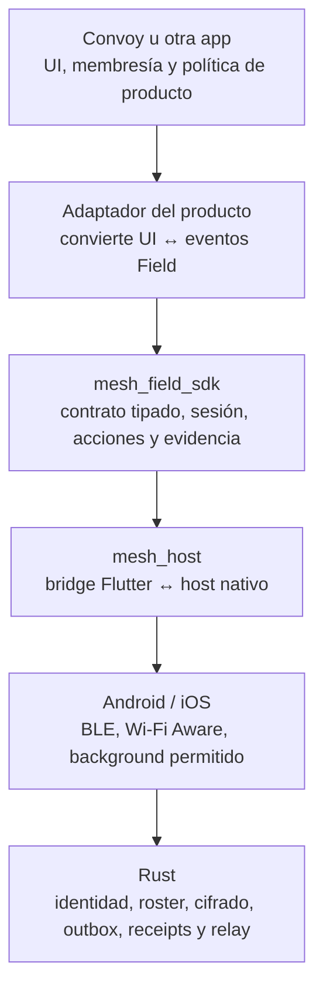

# Plan de cierre del SDK e integración de productos

**Estado:** 2026-09-14. Fachada SDK 100%; cierre operativo 0%; plan global 60%; Wi-Fi Aware 90%.

## Propósito

`mesh_field_sdk` permite a una aplicación intercambiar texto, ubicación puntual
con rumbo y voz con un grupo cercano, sin internet. La aplicación nunca abre un
socket, escanea Bluetooth, usa IP, administra Wi-Fi Aware, implementa Noise ni
maneja claves, receipts o rutas de relay.

La meta es que Convoy sea el primer consumidor y que una aplicación futura use
el mismo paquete sin copiar lógica de radios.

## Capas y límites

- **Producto:** define quién pertenece a una sesión y cómo se presenta cada
  acción. No puede inventar vecinos ni elevar un evento local a entrega global.
- **SDK:** expone modelos seguros: identidad pública, grupo, estado de sesión,
  `FieldDelivery`, `FieldLocation`, texto, voz y eventos entrantes. No expone
  claves, objetos cifrados, IP, SSID, rutas o identidades de vecinos.
- **Host y núcleo:** ejecutan radios, cifrado, cola durable, receipts, dedupe,
  límites de grado y reenvío. Son los únicos que eligen BLE o Wi-Fi Aware.

## Flujo común para cualquier producto

1. La app autentica al usuario y obtiene una autorización firmada para un grupo
   de campo. El SDK prepara la identidad local protegida.
2. La app instala o presenta una inscripción firmada. El host verifica la
   política y el núcleo persiste el roster certificado.
3. La app invoca `connect()`. El host inicia BLE y Wi-Fi Aware cuando existen;
   el núcleo autentica el enlace y recupera objetos pendientes.
4. La app observa `watch()` para mostrar conectado, conectando, sin radio o
   desconectado. No decide por sí misma qué radio usar.
5. La app envía una acción tipada. El SDK devuelve un ID lógico y la evidencia
   agregada de su entrega. El producto muestra cola, parcial, entregado o
   vencido únicamente desde esa evidencia.
6. El SDK emite eventos entrantes tipados. El adaptador del producto los guarda
   y proyecta en su interfaz. El núcleo deduplica y puede reenviar por otros
   miembros autorizados.

## Integración de Convoy

Convoy debe agregar un adaptador `convoy_field_mesh`, no insertar llamadas de
radio en sus pantallas ni en su capa Supabase.

| Necesidad Convoy | Contrato SDK | Adaptador Convoy |
|---|---|---|
| Participante autenticado | Identidad y grupo de campo | Liga el miembro autorizado de la sesión con su inscripción firmada. |
| Estado del convoy | `watch()` | Actualiza el semáforo local; no finge presencia global. |
| Mensaje cercano | `sendText` y `FieldDelivery` | Crea una burbuja local con ID lógico y actualiza su estado verificable. |
| Ubicación de participante | `sendLocation(FieldLocation)` | Convoy envía latitud, longitud, precisión y hora; sus marcadores usan foto o iniciales y no consumen rumbo. |
| Voz | `sendVoice` y recepción de voz | Muestra una nota disponible sólo después de que el SDK confirme su recepción. |
| Mensaje o ubicación recibida | `watchIncoming()` | Inserta contenido cercano en un carril de chat separado hasta que exista una política explícita de sincronización con Supabase. |

El chat oficial remoto de Convoy y el chat cercano son fuentes distintas. No se
mezclarán automáticamente hasta definir la semántica de duplicados, conexión a
internet, autoría y reconciliación. Una entrega mesh no significa que Supabase
la haya persistido, y una entrega remota no significa que llegó al grupo cercano.

## Integración de otras aplicaciones

Una segunda app sólo necesita:

- depender de `mesh_field_sdk`, nunca de `mesh_host`;
- aportar su autenticación y autorización firmada de membresía;
- adaptar `FieldLocation`, texto, voz, sesión y entregas a su interfaz;
- definir su política de retención, historial, background y privacidad.

El mismo grupo de campo no se comparte automáticamente entre productos. Cada
producto debe usar un namespace, autoridad y política propios, aunque reutilice
el transporte y el núcleo.

## Estrategia híbrida Internet + Mesh

Convoy no elegirá Internet *o* mesh de forma global. Cada teléfono medirá ACKs
reales del servidor y podrá cambiar de ruta de manera independiente. Un outbox
con ID lógico estable permitirá que una acción viaje por Internet, mesh o ambos
sin crear duplicados; al volver Internet sincronizará por ID y HLC. El plan de
política, degradación, prioridades y reconciliación está en
[`hybrid-internet-mesh-plan.md`](hybrid-internet-mesh-plan.md).

## Cierre operativo del SDK antes de Convoy

| Etapa | Resultado exigido | Gate |
|---|---|---|
| S1 Contrato | API pública estable, versionada y cubierta | Completada: fachada, análisis y cobertura. |
| S2 Datos por radio | Texto, ubicación con rumbo y voz en BLE/WFA | Prueba física bidireccional por radio soportada. |
| S3 Entrega durable | Receipts, caducidad y reintento iguales para los tres tipos | Reinicio durante cada acción sin duplicar UI. |
| S4 Relay y failover | A→B→C, cambio BLE↔WFA y dedupe por ID lógico | Corte de enlace a mitad de transferencia. |
| S5 Ciclo de vida | Background, autorreconexión y presencia local honesta | Matriz iOS/Android con pantalla bloqueada y retorno. |
| S6 Escala y soporte | 5/10/50, límites, diagnóstico y exportación consentida | Métricas reproducibles y pruebas de presión. |

Solo después de S1–S6 se inicia la integración funcional con Convoy. La
integración de superficie ya existente puede conservarse como smoke test, pero
no se conectarán su chat, mapa o PTT al transporte hasta aprobar esos gates.
