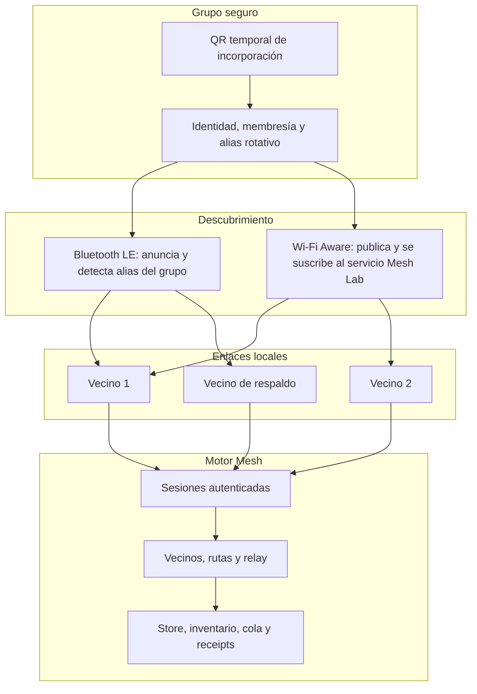

# Wi‑Fi Aware Mesh para 50 teléfonos

> **Meta de producto:** esta especificación define el transporte de un SDK
> reutilizable para comunicación cercana sin internet. Mesh Lab es el laboratorio
> de radios y evidencia; Convoy será su primera integración, sin convertir este
> protocolo en una dependencia de la interfaz de vehículos.

**Estado:** WA‑1 está probado físicamente entre Android compatibles: A73↔S24+ crea un NDP Wi‑Fi Aware cifrado, abre un socket directo y autentica la sesión sin router, SSID, hotspot ni dirección IP introducida. Ambos Android de prueba reportan que no soportan el emparejamiento de sistema que requiere iPhone, por lo que iPhone participa hoy mediante Bluetooth LE autenticado a través de un Android relé. WA‑3 tiene un núcleo determinista de presupuesto, expiración, deduplicación y custodia SQLCipher con metadata de relay; todavía falta que los hosts programen esa cola sobre los enlaces y emitan receipts de custodia.

> **Registro de huecos:** [docs/known-gaps.md](known-gaps.md) contiene los límites, pendientes y evidencias requeridas para cerrar cada uno. Ningún estado de radio o build se interpreta como entrega mesh certificada sin la prueba que ese registro exige.

## Objetivo

Formar una red local de hasta 50 teléfonos autorizados de un mismo grupo sin router, SSID común, internet, hotspot ni dirección IP escrita por una persona. Cada teléfono debe descubrir vecinos, establecer pocos enlaces directos Wi‑Fi Aware y reenviar objetos cifrados por saltos hasta alcanzar sus destinatarios.

Todos los teléfonos que ingresan al perfil de campo deben soportar Wi‑Fi Aware. Bluetooth LE permanece para descubrimiento, control y respaldo temporal cuando Wi‑Fi Aware está momentáneamente indisponible. Un teléfono sin soporte Wi‑Fi Aware no satisface este perfil de 50 nodos.

Un mesh no puede cruzar una separación física sin ningún par de teléfonos al alcance. Si el convoy se parte en dos grupos sin vecino puente, el sistema conserva la cola durable y los grupos convergen al reencontrarse; no inventa una ruta inexistente.

## Lo que se reemplaza

El laboratorio ya no contiene un transporte de aplicación por LAN, dirección IP escrita ni listener TCP sobre la red actual. Los sockets que usa Wi‑Fi Aware se crean únicamente después de que el sistema concede un NDP directo entre vecinos autorizados; no requieren router ni SSID común.

La versión de campo elimina de la interfaz y del transporte de producción:

- Dirección IP y puerto manuales.
- Dependencia de router, SSID, hotspot o datos celulares.
- Un coordinador TCP que limite el grupo a sus sockets directos.

## Capas de red

### 1. Incorporación

El creador abre una ventana breve y enseña un QR temporal. Cada miembro lo escanea una sola vez. El QR identifica una invitación firmada, con expiración, nonce y límite de usos; no contiene una clave reutilizable del grupo.

En iPhone, la aplicación debe completar además el emparejamiento gestionado por el sistema para Wi‑Fi Aware. El QR prueba pertenencia a Mesh Lab; el emparejamiento de plataforma autoriza el enlace radio. Una vez incorporado, el teléfono conserva su identidad y no vuelve a escanear para reconectarse.

### 2. Descubrimiento

Cada teléfono publica un alias rotativo de grupo y escucha el servicio Wi‑Fi Aware de Mesh Lab. Bluetooth LE realiza la misma función de descubrimiento y permite saber que el radio Wi‑Fi Aware desapareció.

El anuncio no expone nombre, número de teléfono, GPS ni secreto del grupo. Solo un teléfono que ya valida el alias y el material de grupo avanza al handshake.

### 3. Enlaces directos y límite de grado

Un miembro no se conecta directamente a los otros 49. Eso produciría 1,225 enlaces y agotaría radios, batería y recursos del sistema. Cada teléfono mantiene un conjunto pequeño de vecinos autenticados.

El perfil inicial usa como límite común **dos enlaces Wi‑Fi Aware activos por teléfono**. El A73 probado reporta dos sesiones de datos Wi‑Fi Aware simultáneas; el límite global se fija al menor valor confirmado por las capacidades de los teléfonos del grupo. Bluetooth puede permanecer como enlace de descubrimiento y respaldo, pero no aumenta artificialmente el grado Wi‑Fi Aware.

El selector de vecinos no elige simplemente el RSSI más alto. Puntúa calidad medida, progreso real, estabilidad, batería, capacidad disponible, diversidad de ruta y valor de cobertura. Dos vecinos hacia la misma zona no cuentan como redundancia. Como objetivo estable de convergencia, el roster certificado ordenado produce un anillo Wi‑Fi Aware de predecesor/sucesor y, para roster par de cuatro o más miembros, una arista Bluetooth hacia el miembro opuesto. Cada miembro calcula el mismo plan; el host abre enlaces solo con vecinos presentes y autenticados.

Cuando la geometría lo permita, el objetivo es dos rutas distintas hacia el resto del grupo. Cuando solo exista un puente, la interfaz lo muestra como ruta única y el store conserva los objetos hasta recibir un custody receipt o hasta vencer su TTL.

### 4. Saltos y routing

Los enlaces directos forman un grafo, no una estrella. El motor mantiene por vecino:

- `PeerId`, alias, capacidades y estado de autenticación.
- RTT, pérdida, goodput, estabilidad, batería reportada y disponibilidad de enlace.
- Coste de ruta, siguiente salto, número de hops y vencimiento de la ruta.
- Inventario resumido de objetos que el vecino puede custodiar o necesita.

Para un destinatario concreto, el motor usa descubrimiento reactivo de ruta: una solicitud de ruta tiene ID único, origen, destino, budget de hops y TTL. Cada nodo guarda la ruta inversa, retransmite una sola copia por enlace útil y el destino devuelve una respuesta por el mejor camino observado. Las rutas se renuevan con tráfico real y expiran si no muestran progreso.

Para mensajes de grupo, GPS y avisos de presencia, se usa relay controlado: ID de objeto, caché de duplicados, previous-hop hint, hop budget y envío escalonado al mejor vecino y luego a un segundo vecino solo si no hay progreso durable. No se hace flooding ciego.

Un relay nunca necesita descifrar el contenido dirigido a otros miembros. Verifica membership, envelope, firma, tamaño y antigüedad; almacena y reenvía los bytes protegidos.

### 5. Durabilidad y recuperación

Antes de transmitir texto, GPS o voz, el origen crea un objeto con ID único y lo confirma en su store local. Un vecino confirma custody solo después de guardarlo. Si un enlace o un teléfono desaparece, la operación vuelve a la cola con los rangos de chunks que faltan; no se declara entregada por haber escrito bytes en un socket.

- **Texto y voz:** objetos durables con receipts de custodia y entrega según contrato.
- **GPS:** datagrama con expiración corta y relay budget. La última posición puede persistirse para la UI, pero una posición vencida no genera backlog infinito.
- **Presencia:** cada enlace emite health y cada cambio de arista se difunde como evento firmado y acotado. Un miembro caído se refleja en los demás tras el timeout de salud y la tabla de rutas se recalcula.

### 6. Selección de transporte

Para cada vecino, Wi‑Fi Aware es preferido cuando está autenticado, saludable y su ETA es mejor. Bluetooth se mantiene disponible como control y fallback. El cambio es make-before-break: se autentica el nuevo enlace, se intercambia inventario y solo entonces se dejan de asignar objetos nuevos al enlace degradado.

La pérdida de Wi‑Fi Aware no cierra la sesión del grupo. El motor vuelve a BLE, conserva la cola y sigue buscando Wi‑Fi Aware. La sesión termina únicamente cuando la persona toca **Salir de sesión**.

## Operación visible en la app

La pantalla de campo no muestra IPs, puertos, SSID ni un botón por radio. Muestra:

- `Conectar sesión` o `Salir de sesión`.
- Semáforo de la sesión y contador de miembros activos, en ruta, pendientes y sin ruta.
- Canal por vecino: `Wi‑Fi Aware`, `Bluetooth de respaldo` o `reconectando`.
- Hop count y ruta única/redundante sin exponer datos sensibles.
- Cola pendiente y motivo si no existe ruta.

## Implementación actual de WA‑0 a WA‑3

- La interfaz ya no expone IP, puerto, router, SSID, hotspot ni un control Wi‑Fi local.
- **Conectar sesión** arranca Bluetooth y el descubrimiento Wi‑Fi Aware; **Salir de sesión** detiene ambos por decisión explícita.
- Android consulta y activa Wi‑Fi Aware con publicación/suscripción NAN al servicio común `_meshlab._tcp`; cada anuncio incorpora una huella opaca de 16 bytes derivada dentro del FFI desde la política de grupo verificada. Solo una coincidencia de esa huella cuenta como vecino del grupo; la sesión Noise continúa siendo obligatoria antes de que exista un enlace seguro. Android escucha cambios de disponibilidad y pérdida de servicio para reconstruir la sesión o retirar el vecino sin tocar controles. El A73 se limita a dos enlaces directos para el perfil inicial.
- iOS consulta capacidades y dispositivos Wi‑Fi Aware vinculados. Desde el único control `Conectar sesión` presenta el selector seguro y permanente de `DeviceDiscoveryUI` cuando no existe ningún equipo vinculado. La app declara `_meshlab._tcp` y solicita los entitlements `Publish` y `Subscribe`. Para iPhone↔iPhone, el adaptador nativo ya crea `NetworkListener`, `NetworkBrowser` y `NetworkConnection<TLS>` sobre dispositivos vinculados, con framing y Noise antes de entregar texto, GPS o voz. Falta validarlo físicamente entre dos iPhone.
- Los A73 y S24+ de la campaña de laboratorio exponen Wi‑Fi Aware, pero reportan `isNanPairingSupported=false`. Por ello no pueden iniciar el emparejamiento de sistema que el iPhone exige; no hay una clave de aplicación que pueda sustituir esa capacidad del firmware.
- Entre los dos Android, el host usa `WifiAwareNetworkSpecifier`, una PSK derivada del material de grupo y `ConnectivityManager` para abrir el NDP. La aplicación no marca el semáforo verde hasta que la sesión Noise sobre el socket Aware está autenticada. La prueba física mantuvo el enlace y el semáforo verde con Bluetooth apagado en ambos Android.
- El adaptador Android reserva como máximo dos NDP Aware, incluidos los que están en negociación. El FFI devuelve solamente las dos huellas públicas de vecinos producidas por `neighbor_plan` desde el roster verificado; el adaptador conserva visibilidad de los demás miembros cercanos, pero no les solicita NDP. Por tanto, un grupo cercano de 50 no puede forzar 49 solicitudes ni agotar el radio.
- El A73 de laboratorio ya puede funcionar como puente de radios: recibe un payload autenticado por Wi‑Fi Aware, elimina duplicados de texto/voz y lo vuelve a cifrar hacia sus vecinos Bluetooth, incluido el iPhone. Esto valida A↔B↔C en laboratorio; todavía no equivale a custody durable ni routing de 50 nodos.
- `mesh-replication::neighbor_plan` deriva ese objetivo de overlay solo del roster certificado, no de Flutter, señal radio o el orden de entrada. Con 50 miembros entrega dos candidatos Aware por teléfono y un chord Bluetooth simétrico; la prueba verifica conectividad total y un máximo de 16 hops. Cada Android consulta ese selector dentro del FFI y crea NDP solo hacia esos dos vecinos. La sustitución temporal de un vecino no disponible y su reincorporación siguen pendientes del controlador de enlaces nativo.
- El TCP histórico por LAN se retiró del host y de la app. Los únicos sockets de producción son los creados sobre NDP Wi‑Fi Aware y se mantienen separados del descubrimiento y de cualquier red Wi‑Fi existente.
- El chat de la app usa `messageId` por origen/secuencia y HLC para orden visible. La réplica completa por inventario y rangos faltantes permanece planificada para WA‑3.
- El roster certificado, su almacenamiento SQLCipher y la inscripción de la autoridad admiten ahora hasta **50 miembros**. Un objeto protegido conserva su límite de diez destinatarios para acotar su sobre de claves; eso no limita al grupo.
- La tabla pura de presencia limita cada teléfono a dos vecinos directos autenticados, prefiere una arista directa saludable sobre una ruta relé, acepta rutas relé de hasta 16 saltos y descarta versiones de presencia atrasadas. Cada entrada caduca con reloj lógico inyectado. `mesh-replication::RelayCache` añade al núcleo de WA‑3 una decisión de forwarding por objeto con `(origin, relayId)`, previous-hop, TTL, hop budget máximo de 16 y caché determinista de 512 entradas. `RelayFrame` tiene una codificación canónica fija de 91 bytes, validada antes de atravesar un host. La migración SQLCipher 005 agrega `relay_outbox` y `relay_metadata`: un objeto remoto completo y su frame canónico conservan custodia en la misma transacción, separados del outbox del origen y de los receipts de destino. Aún falta programar esa cola por cada host y emitir receipts de custodia.
- La migración SQLCipher `004-group-capacity.sql` conserva los certificados de las bases de datos v3 y amplía el índice de roster de 10 a 50. Los bundles autenticados pueden ocupar hasta 64 KiB; el QR de incorporación seguirá siendo un token breve, nunca el roster completo. Cuando la autoridad incorpora un miembro, reparte el bundle firmado por los enlaces ya autenticados en chunks acotados; cada receptor verifica e instala el roster antes de refrescar su publicación Aware. El scheduler de custody/ACK todavía debe confirmar que todos los miembros recibieron esa actualización antes de retirar su configuración previa.

## Fases de sustitución

1. **WA‑0 — contrato y capacidad.** Definir `WifiAwareTransportPort`, modelos de capacidades y reason codes. iOS declara entitlement y servicio; Android consulta capacidad y disponibilidad en tiempo real. La app rechaza el perfil de 50 nodos si falta soporte.
2. **WA‑1 — enlace físico de par.** Android↔iPhone descubre, se empareja, autentica y mueve un frame por Wi‑Fi Aware sin red compartida. El UI no muestra IP.
3. **WA‑2 — failover.** El mismo objeto sigue por BLE cuando Wi‑Fi Aware cae y vuelve a Aware sin duplicado lógico.
4. **WA‑3 — relay durable.** A↔B↔C, sin enlace A↔C, con inventario, custody, dedupe y reencuentro.
5. **WA‑4 — topología acotada.** Simulador determinista de 50 nodos, grado Wi‑Fi Aware máximo dos, movimiento, particiones y reencuentro. El primer perfil probado usa un anillo Wi‑Fi Aware de grado dos y un matching Bluetooth autenticado de respaldo: llega a los 50 miembros en hasta 13 saltos, sin agregar una tercera sesión Wi‑Fi Aware.
6. **WA‑5 — campaña física.** 5, 10 y después 50 teléfonos compatibles; registrar modelo, OS, capacidad, temperatura, batería, rutas, pérdidas y tiempos de recuperación.
7. **WA‑6 — retiro LAN.** **Implementado localmente:** no queda acelerador IP local ni control manual de IP. Mantener una prueba física WFA de regresión después de cambios de host.

## Gates

| Gate | Evidencia necesaria |
|---|---|
| WA‑1 | iPhone↔Android por Wi‑Fi Aware, sin red compartida, sin IP manual y con autenticación de grupo. |
| WA‑2 | Corte de Wi‑Fi Aware durante transferencia: objeto único y progreso por BLE en ≤3 s cuando exista enlace BLE. |
| WA‑3 | A→B→C sin A↔C; texto, GPS y voz entregados según su contrato. |
| WA‑4 | 50 nodos simulados, degree cap respetado, sin loops, memoria/colas acotadas y convergencia tras partición. |
| WA‑5 | Campaña física con 5/10/50 teléfonos compatibles y rutas, fallos, energía y restauración archivados. |
| WA‑6 | No queda código de producción, pantalla ni flujo dependiente de IP local, router o hotspot. |

## Decisiones que no se deben tomar

- No usar hotspot, Wi‑Fi Direct o LAN compartida como sustituto de Wi‑Fi Aware.
- No conectar todos los teléfonos entre sí de manera directa.
- No decidir rutas dentro de Swift, Kotlin o Flutter; los hosts solo reportan enlaces y capacidades.
- No usar RSSI como distancia exacta ni como único criterio de vecino.
- No descartar un objeto antes de su receipt de custodia o entrega aplicable.

## Corte WA‑1 siguiente: ruta de datos, no solo descubrimiento

El descubrimiento y el selector del sistema no constituyen un canal de datos. El
siguiente incremento conecta únicamente estas piezas, en este orden:

1. El vecino que coincide con la huella de grupo recibe un `PeerHandle` efímero.
2. El host Android solicita un `WifiAwareNetworkSpecifier` dirigido a ese
   `PeerHandle` mediante `ConnectivityManager`; el callback obtiene la red
   Aware, sin router, SSID ni IP introducida por una persona.
3. El host iOS usa el dispositivo vinculado por `DeviceDiscoveryUI` y la
   capacidad firmada para abrir su equivalente de enlace directo.
4. Ambos adaptadores mueven por esa red los frames ya acotados de
   `mesh-link::TransportPort`; el motor ejecuta Noise y solamente entonces
   expone `LinkUp` a la app.

## Incremento iPhone↔iPhone

Dos iPhone compatibles deben poder ser vecinos Wi‑Fi Aware del mismo grupo sin
router, internet, hotspot ni Android intermedio. La ruta ya está implementada con el
servicio publicado `_meshlab._tcp` y los dispositivos que el sistema haya
vinculado mediante `DeviceDiscoveryUI`: cada iPhone publica un
`NetworkListener`, explora el servicio con `NetworkBrowser`, y abre un
`NetworkConnection<TLS>` hacia un dispositivo vinculado. Cada stream conserva
framing de longitud, escritura serial y Noise antes de entregar cargas a la capa
compartida de dedupe. La campaña física aún debe comprobar el selector de
vecinos de overlay y relay completo, como describe el registro de huecos.

Apple mantiene el consentimiento de pairing. Mesh Lab puede pedirlo y recordar
los dispositivos autorizados, pero no puede emparejar iPhones en silencio ni
sustituir ese paso con una clave propia. Para la campaña física hacen falta dos
iPhone 12 o posteriores con iOS 26 o posterior, la capacidad Wi‑Fi Aware en
ambas firmas, Wi‑Fi activado y la app en primer plano durante el pairing
inicial. Una vez autorizados, los enlaces se pueden reabrir cuando la app tenga
ejecución en primer plano o background autorizada por iOS.

La huella de descubrimiento no es una clave de enlace ni sustituye Noise. Un
anuncio filtrado, una pareja de sistema o un callback `onAvailable` siguen
siendo insuficientes para marcar una sesión como segura. El gate WA‑1 exige
trama autenticada en ambos sentidos y pérdida explícita del enlace, con los dos
sistemas sin red compartida.
